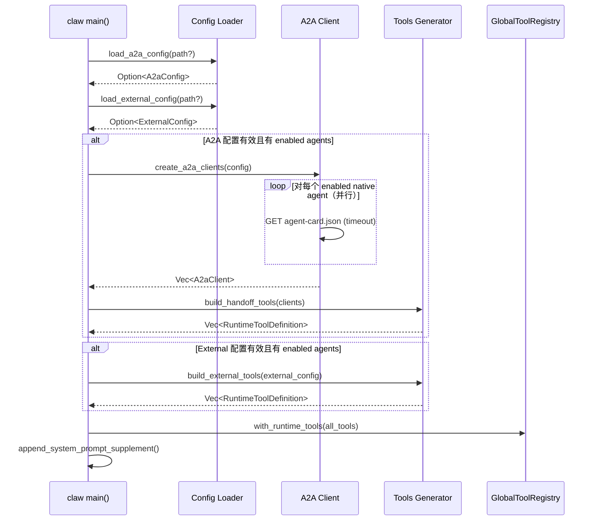

# 设计文档：A2A Protocol Integration

## 概览

本设计为 claw.exe（Rust agent）引入 A2A（Agent2Agent）协议支持，使其通过 function calling 工具机制统一调度原生 A2A Agent 和外部 OpenAI 兼容 Agent。核心原则：**零副作用可选插件**——配置缺失或全部不可达时，claw 行为完全不变。

实现分为两条路径：
1. **原生 A2A 路径**：claw 直连远程 A2A Agent，通过 Agent Card 发现能力，JSON-RPC 委派任务
2. **外部代理路径**：claw 通过后端代理路由访问 OpenAI 兼容平台（FastGPT/Dify），API Key 永不到达 claw 进程

---

## 架构

### 调用链全景

```mermaid
graph TD
    subgraph Claw ["claw.exe (Rust Agent)"]
        CL[Config Loader]
        AC[A2A Client]
        TG[Tools Generator]
        DL[Delegate Engine]
        EA[External Adapter]
    end

    subgraph Remote ["远程 A2A Agent"]
        RC[Agent Card Endpoint]
        RJ[JSON-RPC Endpoint]
    end

    subgraph Backend ["agui-server (后端代理)"]
        PR[Proxy Router]
    end

    subgraph External ["外部平台"]
        FG[FastGPT / Dify]
    end

    CL -->|读取 a2a-agents.json| AC
    CL -->|读取 external-agents.json| EA
    AC -->|GET /.well-known/agent-card.json| RC
    AC -->|缓存 AgentCard| TG
    TG -->|生成 RuntimeToolDefinition| Claw
    DL -->|POST /a2a/jsonrpc message/send| RJ
    EA -->|POST /api/v1/proxy/agent/{id}/chat| PR
    PR -->|附加 API Key 转发| FG
```

### 启动时序



---

## 组件与接口

### 模块职责

| 模块 | 文件路径 | 职责 |
|------|----------|------|
| a2a::config | `src/a2a/config.rs` | 解析 `a2a-agents.json`，路径优先级，`is_a2a_enabled()` |
| a2a::client | `src/a2a/client.rs` | HTTP GET Agent Card，超时控制，AgentCard 缓存 |
| a2a::tools | `src/a2a/tools.rs` | 根据 AgentCard 生成 `RuntimeToolDefinition`，system prompt supplement |
| a2a::delegate | `src/a2a/delegate.rs` | JSON-RPC 请求构造，流式事件解析，TaskProgress 内存表，format_tool_output |
| external::config | `src/external/config.rs` | 解析 `external-agents.json`，验证无 api_key 字段 |
| external::adapter | `src/external/adapter.rs` | 向后端代理发 POST 请求，格式化响应 |

### 公开接口

```rust
// src/a2a/config.rs
pub fn load_a2a_config(explicit_path: Option<&Path>) -> Option<A2aConfig>;
pub fn is_a2a_enabled(config: &Option<A2aConfig>) -> bool;

// src/a2a/client.rs
pub async fn create_a2a_clients(config: &A2aConfig) -> Vec<A2aClient>;

// src/a2a/tools.rs
pub fn build_handoff_tools(clients: &[A2aClient]) -> Vec<RuntimeToolDefinition>;
pub fn build_system_prompt_supplement(clients: &[A2aClient]) -> Option<String>;

// src/a2a/delegate.rs
pub async fn delegate_task(client: &A2aClient, task: &str, webhook: Option<&WebhookConfig>) -> String;

// src/external/config.rs
pub fn load_external_config(explicit_path: Option<&Path>) -> Option<ExternalConfig>;

// src/external/adapter.rs
pub async fn call_external_agent(
    proxy_base_url: &str,
    agent_id: &str,
    message: &str,
    history: &[ChatMessage],
) -> String;

// 集成入口（tools.rs 或独立的 integration 模块）
pub fn build_external_tools(config: &ExternalConfig) -> Vec<RuntimeToolDefinition>;
```

---

## 数据模型

```rust
use serde::{Deserialize, Serialize};
use std::collections::HashMap;

// ===== a2a-agents.json 配置 =====

#[derive(Debug, Clone, Deserialize)]
pub struct A2aConfig {
    pub agents: Vec<A2aAgentEntry>,
    #[serde(default)]
    pub webhook: Option<WebhookConfig>,
    #[serde(default)]
    pub options: A2aOptions,
}

#[derive(Debug, Clone, Deserialize)]
pub struct A2aAgentEntry {
    pub id: String,
    #[serde(rename = "type")]
    pub agent_type: String,        // "native"
    pub url: String,
    #[serde(default = "default_true")]
    pub enabled: bool,
}

#[derive(Debug, Clone, Deserialize)]
pub struct WebhookConfig {
    #[serde(default)]
    pub enabled: bool,
    #[serde(default)]
    pub url: String,
    #[serde(default)]
    pub token: String,
}

#[derive(Debug, Clone, Deserialize)]
pub struct A2aOptions {
    #[serde(default = "default_connect_timeout")]
    pub connect_timeout_ms: u64,   // 默认 5000
    #[serde(default)]
    pub fail_fast: bool,           // 默认 false
}

impl Default for A2aOptions {
    fn default() -> Self {
        Self {
            connect_timeout_ms: 5000,
            fail_fast: false,
        }
    }
}

fn default_true() -> bool { true }
fn default_connect_timeout() -> u64 { 5000 }

// ===== Agent Card（从远程获取） =====

#[derive(Debug, Clone, Deserialize)]
pub struct AgentCard {
    pub name: String,
    pub description: String,
    #[serde(default)]
    pub skills: Vec<AgentSkill>,
}

#[derive(Debug, Clone, Deserialize)]
pub struct AgentSkill {
    pub name: String,
    #[serde(default)]
    pub description: String,
}

// ===== A2A Client 运行时结构 =====

pub struct A2aClient {
    pub id: String,
    pub base_url: String,
    pub card: AgentCard,
    pub http_client: reqwest::Client,
}

// ===== JSON-RPC 请求/响应 =====

#[derive(Debug, Serialize)]
pub struct JsonRpcRequest {
    pub jsonrpc: String,          // "2.0"
    pub method: String,           // "message/send"
    pub id: String,               // uuid v4
    pub params: MessageSendParams,
}

#[derive(Debug, Serialize)]
pub struct MessageSendParams {
    pub message: TaskMessage,
    #[serde(skip_serializing_if = "Option::is_none")]
    pub push_notification_config: Option<PushNotificationConfig>,
}

#[derive(Debug, Serialize)]
pub struct TaskMessage {
    pub role: String,             // "user"
    pub parts: Vec<MessagePart>,
}

#[derive(Debug, Serialize)]
#[serde(tag = "type")]
pub enum MessagePart {
    #[serde(rename = "text")]
    Text { text: String },
}

#[derive(Debug, Serialize)]
pub struct PushNotificationConfig {
    pub url: String,
    pub token: String,
}

// ===== 流式事件响应 =====

#[derive(Debug, Deserialize)]
#[serde(tag = "type")]
pub enum A2aEvent {
    #[serde(rename = "task")]
    Task(TaskEvent),
    #[serde(rename = "status-update")]
    StatusUpdate(StatusUpdateEvent),
    #[serde(rename = "artifact-update")]
    ArtifactUpdate(ArtifactUpdateEvent),
}

#[derive(Debug, Deserialize)]
pub struct TaskEvent {
    pub task_id: String,
    pub status: TaskStatus,
}

#[derive(Debug, Deserialize)]
pub struct StatusUpdateEvent {
    pub task_id: String,
    pub status: TaskStatus,
    #[serde(default)]
    pub r#final: bool,
}

#[derive(Debug, Clone, Deserialize, Serialize)]
pub struct TaskStatus {
    pub state: String,            // submitted, working, completed, failed, canceled
    #[serde(default)]
    pub message: Option<String>,
}

#[derive(Debug, Deserialize)]
pub struct ArtifactUpdateEvent {
    pub task_id: String,
    pub artifact: ArtifactInfo,
}

#[derive(Debug, Deserialize)]
pub struct ArtifactInfo {
    pub name: String,
    #[serde(default)]
    pub parts: Vec<ArtifactPart>,
}

#[derive(Debug, Deserialize)]
#[serde(tag = "type")]
pub enum ArtifactPart {
    #[serde(rename = "text")]
    Text { text: String },
}

// ===== TaskProgress 内存表 =====

pub struct TaskProgress {
    pub task_id: String,
    pub agent_name: String,
    pub states: Vec<String>,      // ["submitted", "working", "completed"]
    pub artifacts: Vec<String>,   // artifact names
    pub result_text: Option<String>,
}

// ===== external-agents.json 配置 =====

#[derive(Debug, Clone, Deserialize)]
pub struct ExternalConfig {
    pub proxy_base_url: String,
    pub agents: Vec<ExternalAgentEntry>,
}

#[derive(Debug, Clone, Deserialize)]
pub struct ExternalAgentEntry {
    pub id: String,
    #[serde(rename = "type")]
    pub agent_type: String,       // "openai_compatible"
    pub name: String,
    pub description: String,
    #[serde(default = "default_true")]
    pub enabled: bool,
}

// ===== 外部 Agent 代理请求 =====

#[derive(Debug, Serialize)]
pub struct ExternalChatRequest {
    pub message: String,
    #[serde(default)]
    pub history: Vec<ChatMessage>,
}

#[derive(Debug, Clone, Serialize, Deserialize)]
pub struct ChatMessage {
    pub role: String,
    pub content: String,
}

#[derive(Debug, Deserialize)]
pub struct ExternalChatResponse {
    pub reply: String,
}
```

---

## 模块详细设计

### 1. `src/a2a/config.rs` — 配置加载

**路径优先级**（高到低）：
1. 函数参数 `explicit_path: Option<&Path>`
2. 环境变量 `A2A_CONFIG_PATH`
3. 默认路径 `{workspace_root}/.claw/a2a-agents.json`

```rust
use std::path::{Path, PathBuf};
use log::{info, warn};

/// 解析配置文件路径
fn resolve_config_path(explicit_path: Option<&Path>) -> PathBuf {
    if let Some(p) = explicit_path {
        return p.to_path_buf();
    }
    if let Ok(env_path) = std::env::var("A2A_CONFIG_PATH") {
        return PathBuf::from(env_path);
    }
    // workspace_root 通常为 claw 的 cwd 或 %APPDATA%/frontier-desktop
    let workspace = std::env::current_dir().unwrap_or_default();
    workspace.join(".claw").join("a2a-agents.json")
}

/// 加载 A2A 配置，失败返回 None（零副作用）
pub fn load_a2a_config(explicit_path: Option<&Path>) -> Option<A2aConfig> {
    let path = resolve_config_path(explicit_path);
    let content = match std::fs::read_to_string(&path) {
        Ok(c) => c,
        Err(_) => {
            info!("A2A config not found at {:?}, skipping", path);
            return None;
        }
    };
    match serde_json::from_str::<A2aConfig>(&content) {
        Ok(config) => {
            for agent in &config.agents {
                info!(
                    "A2A agent parsed: id={}, type={}, url={}, enabled={}",
                    agent.id, agent.agent_type, agent.url, agent.enabled
                );
            }
            Some(config)
        }
        Err(e) => {
            warn!("A2A config parse error at {:?}: {}", path, e);
            None
        }
    }
}

/// 判断 A2A 是否启用（有配置且有至少一个 enabled agent）
pub fn is_a2a_enabled(config: &Option<A2aConfig>) -> bool {
    config
        .as_ref()
        .map(|c| c.agents.iter().any(|a| a.enabled))
        .unwrap_or(false)
}
```

---

### 2. `src/a2a/client.rs` — Agent Card 拉取与客户端创建

```rust
use reqwest::Client;
use std::time::Duration;
use log::warn;

/// 并行拉取所有 enabled native agent 的 Agent Card，创建客户端
pub async fn create_a2a_clients(config: &A2aConfig) -> Vec<A2aClient> {
    let timeout = Duration::from_millis(config.options.connect_timeout_ms);
    let http_client = Client::builder()
        .connect_timeout(timeout)
        .timeout(timeout)
        .build()
        .expect("failed to build HTTP client");

    let enabled_natives: Vec<&A2aAgentEntry> = config
        .agents
        .iter()
        .filter(|a| a.enabled && a.agent_type == "native")
        .collect();

    // 并行拉取 Agent Card（tokio::spawn）
    let mut handles = Vec::new();
    for agent in &enabled_natives {
        let url = format!("{}/.well-known/agent-card.json", agent.url.trim_end_matches('/'));
        let client = http_client.clone();
        let id = agent.id.clone();
        let base_url = agent.url.clone();
        let fail_fast = config.options.fail_fast;

        handles.push(tokio::spawn(async move {
            match client.get(&url).send().await {
                Ok(resp) if resp.status().is_success() => {
                    match resp.json::<AgentCard>().await {
                        Ok(card) => Some(A2aClient {
                            id,
                            base_url,
                            card,
                            http_client: client,
                        }),
                        Err(e) => {
                            warn!("Failed to parse Agent Card from {}: {}", url, e);
                            None
                        }
                    }
                }
                Ok(resp) => {
                    warn!("Agent Card request to {} returned status {}", url, resp.status());
                    None
                }
                Err(e) => {
                    warn!("Agent Card request to {} failed: {}", url, e);
                    if fail_fast {
                        // 在 fail_fast 模式下需要向上传播错误
                        // 此处简化处理：返回 None，由调用者判断
                    }
                    None
                }
            }
        }));
    }

    let mut clients = Vec::new();
    for handle in handles {
        if let Ok(Some(client)) = handle.await {
            clients.push(client);
        }
    }

    // fail_fast 模式：如果有 agent 不可达则视为错误
    if config.options.fail_fast && clients.len() < enabled_natives.len() {
        // 在 fail_fast 模式，调用者应检查返回数量并决定是否 abort
        warn!("fail_fast enabled: some agents unreachable");
    }

    clients
}
```

**缓存策略**：`A2aClient` 在启动时创建一次，整个进程生命周期内复用，不重新拉取 Agent Card。

---

### 3. `src/a2a/tools.rs` — Handoff 工具生成

```rust
use serde_json::json;

/// 将 Agent Card name 转为 snake_case 工具名
fn to_snake_case(name: &str) -> String {
    let mut result = String::new();
    for (i, ch) in name.chars().enumerate() {
        if ch.is_uppercase() && i > 0 {
            result.push('_');
        }
        if ch.is_alphanumeric() {
            result.push(ch.to_lowercase().next().unwrap());
        } else if ch == ' ' || ch == '-' {
            result.push('_');
        }
    }
    // 去除连续下划线
    result.split('_').filter(|s| !s.is_empty()).collect::<Vec<_>>().join("_")
}

/// 为所有可达的原生 A2A Agent 生成 RuntimeToolDefinition
pub fn build_handoff_tools(clients: &[A2aClient]) -> Vec<RuntimeToolDefinition> {
    clients.iter().map(|client| {
        let tool_name = to_snake_case(&client.card.name);
        let description = build_tool_description(&client.card);
        let input_schema = json!({
            "type": "object",
            "properties": {
                "task": {
                    "type": "string",
                    "description": "委派给该专家的完整自然语言任务"
                }
            },
            "required": ["task"]
        });

        RuntimeToolDefinition {
            name: tool_name,
            description: Some(description),
            input_schema,
            required_permission: PermissionMode::Allowed,
        }
    }).collect()
}

fn build_tool_description(card: &AgentCard) -> String {
    let mut desc = card.description.clone();
    if !card.skills.is_empty() {
        desc.push_str(" Skills: ");
        let skills_text: Vec<String> = card.skills.iter()
            .map(|s| format!("{}: {}", s.name, s.description))
            .collect();
        desc.push_str(&skills_text.join("; "));
    }
    desc
}

/// 为外部 Agent 生成 RuntimeToolDefinition
pub fn build_external_tools(config: &ExternalConfig) -> Vec<RuntimeToolDefinition> {
    config.agents.iter()
        .filter(|a| a.enabled)
        .map(|agent| {
            let tool_name = to_snake_case(&agent.id);
            let input_schema = json!({
                "type": "object",
                "properties": {
                    "task": {
                        "type": "string",
                        "description": "委派给该专家的完整自然语言任务"
                    }
                },
                "required": ["task"]
            });

            RuntimeToolDefinition {
                name: tool_name,
                description: Some(agent.description.clone()),
                input_schema,
                required_permission: PermissionMode::Allowed,
            }
        }).collect()
}

/// 生成 system prompt 补充文本
pub fn build_system_prompt_supplement(
    a2a_clients: &[A2aClient],
    external_agents: &[ExternalAgentEntry],
) -> Option<String> {
    if a2a_clients.is_empty() && external_agents.is_empty() {
        return None;
    }

    let mut lines = vec![
        "\n## 远程专家委派".to_string(),
        "你可以通过以下工具将任务委派给远程专家：".to_string(),
    ];

    for client in a2a_clients {
        let tool_name = to_snake_case(&client.card.name);
        lines.push(format!("- `{}`: {}", tool_name, client.card.description));
    }

    for agent in external_agents.iter().filter(|a| a.enabled) {
        let tool_name = to_snake_case(&agent.id);
        lines.push(format!("- `{}`: {}", tool_name, agent.description));
    }

    lines.push("\n调用这些工具时，请在 task 参数中提供完整的自然语言任务描述。".to_string());

    Some(lines.join("\n"))
}
```

---

### 4. `src/a2a/delegate.rs` — 任务委派与流式进度

```rust
use uuid::Uuid;
use log::{info, warn};

/// 向远程 A2A Agent 委派任务，返回格式化的工具输出
pub async fn delegate_task(
    client: &A2aClient,
    task_text: &str,
    webhook: Option<&WebhookConfig>,
) -> String {
    let request = build_jsonrpc_request(task_text, webhook);
    let url = format!("{}/a2a/jsonrpc", client.base_url.trim_end_matches('/'));

    let response = match client.http_client
        .post(&url)
        .json(&request)
        .send()
        .await
    {
        Ok(resp) => resp,
        Err(e) => {
            return format!("[{}] Error: {}", client.card.name, e);
        }
    };

    if !response.status().is_success() {
        return format!(
            "[{}] Error: HTTP {}",
            client.card.name,
            response.status()
        );
    }

    // 解析流式事件
    parse_streaming_response(response, &client.card.name).await
}

fn build_jsonrpc_request(task_text: &str, webhook: Option<&WebhookConfig>) -> JsonRpcRequest {
    let push_config = webhook
        .filter(|w| w.enabled)
        .map(|w| PushNotificationConfig {
            url: w.url.clone(),
            token: w.token.clone(),
        });

    JsonRpcRequest {
        jsonrpc: "2.0".to_string(),
        method: "message/send".to_string(),
        id: Uuid::new_v4().to_string(),
        params: MessageSendParams {
            message: TaskMessage {
                role: "user".to_string(),
                parts: vec![MessagePart::Text { text: task_text.to_string() }],
            },
            push_notification_config: push_config,
        },
    }
}

/// 解析流式 JSON 响应，构建 TaskProgress 并格式化输出
async fn parse_streaming_response(response: reqwest::Response, agent_name: &str) -> String {
    let mut progress = TaskProgress {
        task_id: String::new(),
        agent_name: agent_name.to_string(),
        states: Vec::new(),
        artifacts: Vec::new(),
        result_text: None,
    };

    // 读取响应体（可能是 SSE 流或一次性 JSON）
    let body = match response.text().await {
        Ok(b) => b,
        Err(e) => return format!("[{}] Error reading response: {}", agent_name, e),
    };

    // 尝试解析为 JSON-RPC 响应
    if let Ok(events) = parse_events_from_body(&body) {
        for event in events {
            match event {
                A2aEvent::Task(te) => {
                    progress.task_id = te.task_id;
                    progress.states.push(te.status.state);
                }
                A2aEvent::StatusUpdate(su) => {
                    progress.states.push(su.status.state.clone());
                    if su.r#final {
                        if let Some(msg) = su.status.message {
                            progress.result_text = Some(msg);
                        }
                    }
                }
                A2aEvent::ArtifactUpdate(au) => {
                    progress.artifacts.push(au.artifact.name.clone());
                    // 提取文本 artifact 作为结果
                    for part in &au.artifact.parts {
                        if let ArtifactPart::Text { text } = part {
                            progress.result_text = Some(text.clone());
                        }
                    }
                }
            }
        }
    } else {
        // 非流式单次响应的降级处理
        progress.result_text = Some(body);
    }

    format_tool_output(&progress)
}

/// 从响应体解析事件列表
fn parse_events_from_body(body: &str) -> Result<Vec<A2aEvent>, serde_json::Error> {
    // 尝试解析为 JSON-RPC 成功响应中嵌套的事件
    #[derive(Deserialize)]
    struct JsonRpcResponse {
        result: Option<serde_json::Value>,
    }

    if let Ok(rpc_resp) = serde_json::from_str::<JsonRpcResponse>(body) {
        if let Some(result) = rpc_resp.result {
            // result 可能是单个 task event 或 events 数组
            if let Ok(events) = serde_json::from_value::<Vec<A2aEvent>>(result.clone()) {
                return Ok(events);
            }
            if let Ok(event) = serde_json::from_value::<A2aEvent>(result) {
                return Ok(vec![event]);
            }
        }
    }

    // 尝试按行解析 SSE 事件
    let mut events = Vec::new();
    for line in body.lines() {
        let line = line.trim();
        if line.starts_with("data:") {
            let data = line.trim_start_matches("data:").trim();
            if let Ok(event) = serde_json::from_str::<A2aEvent>(data) {
                events.push(event);
            }
        }
    }

    if events.is_empty() {
        Err(serde_json::Error::custom("no events parsed"))
    } else {
        Ok(events)
    }
}

/// 格式化工具输出
pub fn format_tool_output(progress: &TaskProgress) -> String {
    let states_chain = progress.states.join(" → ");
    let result = progress.result_text.as_deref().unwrap_or("(no result)");

    format!(
        "[{}] Task {}: {}\nResult: {}",
        progress.agent_name,
        progress.task_id,
        states_chain,
        result
    )
}
```

---

### 5. `src/external/config.rs` — 外部 Agent 配置加载

```rust
use std::path::{Path, PathBuf};
use log::{info, warn};

fn resolve_external_config_path(explicit_path: Option<&Path>) -> PathBuf {
    if let Some(p) = explicit_path {
        return p.to_path_buf();
    }
    let workspace = std::env::current_dir().unwrap_or_default();
    workspace.join(".claw").join("external-agents.json")
}

pub fn load_external_config(explicit_path: Option<&Path>) -> Option<ExternalConfig> {
    let path = resolve_external_config_path(explicit_path);
    let content = match std::fs::read_to_string(&path) {
        Ok(c) => c,
        Err(_) => {
            info!("External agents config not found at {:?}, skipping", path);
            return None;
        }
    };

    // 安全检查：配置文件不应包含 api_key
    if content.contains("\"api_key\"") || content.contains("\"apiKey\"") {
        warn!("External agents config contains api_key field, rejected for security");
        return None;
    }

    match serde_json::from_str::<ExternalConfig>(&content) {
        Ok(config) => {
            for agent in &config.agents {
                info!(
                    "External agent parsed: id={}, type={}, name={}, enabled={}",
                    agent.id, agent.agent_type, agent.name, agent.enabled
                );
            }
            Some(config)
        }
        Err(e) => {
            warn!("External agents config parse error at {:?}: {}", path, e);
            None
        }
    }
}
```

---

### 6. `src/external/adapter.rs` — 外部 Agent 代理调用

```rust
use log::warn;
use reqwest::Client;

/// 通过后端代理调用外部 Agent
pub async fn call_external_agent(
    proxy_base_url: &str,
    agent_id: &str,
    message: &str,
    history: &[ChatMessage],
) -> String {
    let url = format!("{}/{}/chat", proxy_base_url.trim_end_matches('/'), agent_id);
    let body = ExternalChatRequest {
        message: message.to_string(),
        history: history.to_vec(),
    };

    let client = Client::new();
    match client.post(&url).json(&body).send().await {
        Ok(resp) if resp.status().is_success() => {
            match resp.json::<ExternalChatResponse>().await {
                Ok(chat_resp) => {
                    format!("[外部 Agent] processing → success\nResult: {}", chat_resp.reply)
                }
                Err(e) => {
                    format!("[外部 Agent] Error: failed to parse response: {}", e)
                }
            }
        }
        Ok(resp) => {
            let status = resp.status();
            let body = resp.text().await.unwrap_or_default();
            format!("[外部 Agent] Error: HTTP {} - {}", status, body)
        }
        Err(e) => {
            format!("[外部 Agent] Error: {}", e)
        }
    }
}
```

---

### 7. 集成挂点

在 claw 启动路径（`main()` 或 `bootstrap()`）中的 4 个集成点：

```rust
// === 挂点 1: 启动时加载配置 ===
// 位置: 在 MCP 工具加载之后、GlobalToolRegistry 构建之前
let a2a_config = a2a::config::load_a2a_config(None);
let external_config = external::config::load_external_config(None);

// === 挂点 2: Agent 初始化合并工具 ===
let mut runtime_tools: Vec<RuntimeToolDefinition> = Vec::new();

if a2a::config::is_a2a_enabled(&a2a_config) {
    let a2a_clients = a2a::client::create_a2a_clients(a2a_config.as_ref().unwrap()).await;
    let handoff_tools = a2a::tools::build_handoff_tools(&a2a_clients);
    runtime_tools.extend(handoff_tools);

    // 生成 system prompt supplement
    let enabled_externals: Vec<_> = external_config
        .as_ref()
        .map(|c| c.agents.iter().filter(|a| a.enabled).cloned().collect())
        .unwrap_or_default();

    if let Some(supplement) = a2a::tools::build_system_prompt_supplement(&a2a_clients, &enabled_externals) {
        system_prompt.push_str(&supplement);
    }

    // 存储 clients 供后续 tool 执行使用
    // 使用 Arc<Vec<A2aClient>> 或注册到全局状态
}

if let Some(ref ext_config) = external_config {
    let ext_tools = a2a::tools::build_external_tools(ext_config);
    runtime_tools.extend(ext_tools);
}

// 将 runtime_tools 追加到 GlobalToolRegistry
let registry = GlobalToolRegistry::with_plugin_tools(plugin_tools)?
    .with_runtime_tools(runtime_tools)?;

// === 挂点 3: Handoff Tool 执行时 ===
// 在 execute_tool 分支中，识别 handoff tool 并调用 delegate_task
// 伪代码:
fn execute_handoff_tool(tool_name: &str, input: &Value) -> Result<String, String> {
    let task = input.get("task")
        .and_then(|v| v.as_str())
        .ok_or("missing 'task' parameter")?;

    // 查找对应的 A2aClient 或 ExternalAgent
    if let Some(client) = find_a2a_client_by_tool_name(tool_name) {
        let webhook = get_webhook_config();
        // 异步执行
        tokio::runtime::Handle::current().block_on(
            a2a::delegate::delegate_task(client, task, webhook.as_ref())
        )
    } else if let Some((proxy_url, agent_id)) = find_external_agent_by_tool_name(tool_name) {
        tokio::runtime::Handle::current().block_on(
            external::adapter::call_external_agent(proxy_url, agent_id, task, &[])
        )
    } else {
        Err(format!("unknown handoff tool: {}", tool_name))
    }
}

// === 挂点 4: Tool 返回字符串 ===
// delegate_task / call_external_agent 的返回值直接作为 tool result
// 格式: "[{agent_name}] Task {task_id}: {states_chain}\nResult: {result_text}"
// 该字符串通过现有 TCP→SSE 管道传递到前端
```

---

### 8. 后端代理端点设计

在 `agui-server.ts` 中新增代理路由（不修改现有 SSE 逻辑）：

```
POST /api/v1/proxy/agent/:agentId/chat
```

**请求流程**：
1. 验证请求合法性（来自 claw 的本地 TCP 连接）
2. 从安全存储加载目标 agent 的 API Key（本地开发：JSON 文件，生产：数据库）
3. 构造 OpenAI 兼容请求体（将 message+history 转换为 messages 数组）
4. 附加 API Key 转发到外部平台
5. 返回响应（过滤 api_key 字段）

**IDOR 防护**：
- 验证 agentId 属于当前用户的配置
- 未授权访问返回 404（不暴露 agent 是否存在）

**Payload 转换**：
```
输入: { message: "...", history: [{role, content}, ...] }
转换为: { messages: [...history, {role: "user", content: message}] }
附加: Authorization: Bearer {api_key}
```

---

### 9. 增量进度 UI 展示

任务执行过程中的增量进度通过现有 TCP→SSE 管道透传：

1. `delegate_task` 在解析流式事件时，通过回调将中间状态发送到 TCP 连接
2. agui-server 收到 TCP 消息后通过 SSE `tool_start` / `tool_end` 事件传递到前端
3. 前端已有工具执行结果展示逻辑，无需修改

对于长时间运行的任务，可在 `delegate_task` 中通过 TCP 发送增量文本：
```rust
// 在流式解析循环中，每收到 status-update 就发送增量
fn on_status_update(status: &str, tcp_sender: &Sender<String>) {
    let progress_text = format!("⏳ Status: {}", status);
    let _ = tcp_sender.send(progress_text);
}
```

---

## 错误处理与容错策略

| 场景 | 处理方式 |
|------|----------|
| 配置文件不存在 | info 日志，返回 None，零副作用 |
| 配置 JSON 格式无效 | warn 日志，返回 None，零副作用 |
| Agent Card 请求超时 | 受 `connectTimeoutMs` 约束，跳过该 agent |
| Agent Card 请求失败 + failFast=false | warn 日志，跳过该 agent |
| Agent Card 请求失败 + failFast=true | 终止启动，返回错误 |
| delegate_task 请求失败 | 返回 `"[{name}] Error: {msg}"` 作为 tool output |
| delegate_task 响应解析失败 | 将原始响应体作为 result_text 返回 |
| 外部代理请求失败 | 返回错误描述的 tool output |
| 所有 agents 均不可达 + failFast=false | 工具列表为空，system prompt 无补充 |
| external config 包含 api_key | warn 日志，拒绝加载该配置 |

**核心原则**：任何 A2A/External 相关的失败都不会阻塞 claw 的正常功能（除非 failFast=true）。tool 执行失败以错误文本形式返回给 LLM，由 LLM 决定后续策略。

---

## Correctness Properties

*A property is a characteristic or behavior that should hold true across all valid executions of a system—essentially, a formal statement about what the system should do. Properties serve as the bridge between human-readable specifications and machine-verifiable correctness guarantees.*

### Property 1: Config path resolution priority

*For any* combination of (explicit_path, env_var, default_path) where explicit_path is Some, the resolved config path should always equal explicit_path regardless of env_var or default_path values. When explicit_path is None and env_var is set, the result should be the env_var path. Only when both are absent should the default path be used.

**Validates: Requirements 1.1**

### Property 2: Config serialization round-trip

*For any* valid `A2aConfig`, `AgentCard`, or `ExternalConfig` value, serializing to JSON via serde_json then deserializing back should produce a value equal to the original.

**Validates: Requirements 1.2, 2.2, 7.2**

### Property 3: Invalid JSON input yields None

*For any* string that is not valid JSON (random bytes, truncated JSON, malformed structures), `load_a2a_config` and `load_external_config` should return None without panicking.

**Validates: Requirements 1.4**

### Property 4: Enabled field defaults to true

*For any* A2aAgentEntry JSON object that omits the "enabled" field, deserialization should set `enabled = true`.

**Validates: Requirements 1.5**

### Property 5: Agent filtering — only enabled native agents get card requests

*For any* `A2aConfig` containing a mix of enabled/disabled and native/non-native agents, `create_a2a_clients` should only attempt Agent Card fetch for agents where `enabled == true && agent_type == "native"`. The resulting client list should be a subset of those agents.

**Validates: Requirements 2.1, 2.3**

### Property 6: Fault tolerance — failFast=false skips unreachable agents

*For any* set of agent URLs where some are unreachable, when `options.fail_fast == false`, `create_a2a_clients` should return only successfully connected clients without error, and the count should equal the number of reachable agents.

**Validates: Requirements 2.3, 2.4, 6.1, 6.2, 6.3**

### Property 7: Tool name snake_case conversion

*For any* non-empty string representing an Agent Card name, `to_snake_case` should produce a string that: (a) contains only lowercase alphanumeric characters and underscores, (b) does not start or end with underscore, (c) contains no consecutive underscores.

**Validates: Requirements 3.2**

### Property 8: Tool generation count invariant

*For any* list of N `A2aClient` instances, `build_handoff_tools` should produce exactly N `RuntimeToolDefinition` entries. *For any* `ExternalConfig` with M enabled agents, `build_external_tools` should produce exactly M entries.

**Validates: Requirements 3.1, 8.1**

### Property 9: Tool definition completeness

*For any* `AgentCard` with at least one skill, the generated tool description should contain the card's description text AND every skill name. The input_schema should always have exactly one required property named "task" of type "string".

**Validates: Requirements 3.3, 3.4, 8.2**

### Property 10: System prompt supplement contains all tool names

*For any* non-empty combination of A2A clients and external agents, `build_system_prompt_supplement` should return `Some(text)` where text contains the snake_case tool name for every provided client/agent.

**Validates: Requirements 3.6**

### Property 11: JSON-RPC request construction

*For any* task text string, `build_jsonrpc_request` should produce a request where: jsonrpc == "2.0", method == "message/send", the message contains the task text in a Text part, and push_notification_config is present if and only if webhook is Some with enabled=true.

**Validates: Requirements 4.1, 4.2**

### Property 12: Event processing accumulation

*For any* sequence of `A2aEvent` values, processing them into a `TaskProgress` should: (a) set task_id from the first Task event, (b) append every status state to the states list in order, (c) append every artifact name to the artifacts list, (d) set result_text from the last final=true event's message or last text artifact.

**Validates: Requirements 4.3, 5.1, 5.2, 5.3**

### Property 13: format_tool_output matches specification

*For any* `TaskProgress` with non-empty agent_name, task_id, and states, `format_tool_output` should produce a string matching the pattern `"[{agent_name}] Task {task_id}: {states joined by ' → '}\nResult: {result_text or '(no result)'}"`.

**Validates: Requirements 5.4**

### Property 14: External agent config rejects api_key presence

*For any* JSON string that contains the substring `"api_key"` or `"apiKey"`, `load_external_config` should return None.

**Validates: Requirements 7.4, 9.1**

### Property 15: OpenAI payload transformation

*For any* (message, history) pair, the transformed payload should be a messages array equal to `[...history, {role: "user", content: message}]`, preserving order and content of history entries.

**Validates: Requirements 9.4**

---

## 测试策略

### Property-Based Testing

使用 **proptest** crate（Rust 生态标准 PBT 库）进行属性测试。

**配置要求**：
- 每个 property test 最少 100 次迭代（proptest 默认 256）
- 每个 test 通过注释标注对应的设计属性
- 标注格式：`// Feature: a2a-protocol-integration, Property {N}: {title}`

**需要实现的 property tests**：

1. `test_config_path_priority` — 生成随机路径组合，验证优先级
2. `test_config_round_trip` — 生成随机 A2aConfig/AgentCard/ExternalConfig，验证序列化往返
3. `test_invalid_json_returns_none` — 生成随机非 JSON 字符串，验证返回 None
4. `test_enabled_defaults_true` — 生成缺少 enabled 字段的 JSON，验证默认值
5. `test_agent_filtering` — 生成混合 enabled/type 的 agents，验证过滤结果
6. `test_fail_fast_behavior` — 模拟部分不可达，验证 failFast 行为
7. `test_snake_case_conversion` — 生成随机字符串，验证输出格式
8. `test_tool_generation_count` — 生成随机 clients/config，验证工具数量
9. `test_tool_definition_completeness` — 生成随机 AgentCard，验证描述和 schema
10. `test_system_prompt_contains_names` — 生成随机 clients，验证 prompt 包含所有名称
11. `test_jsonrpc_request_construction` — 生成随机 task/webhook，验证请求结构
12. `test_event_accumulation` — 生成随机事件序列，验证 TaskProgress 状态
13. `test_format_tool_output` — 生成随机 TaskProgress，验证输出格式
14. `test_api_key_rejection` — 生成包含 api_key 的 JSON，验证拒绝
15. `test_openai_payload_transformation` — 生成随机 message/history，验证转换

### Unit Tests

单元测试聚焦于具体示例、边界条件和集成点：

- 配置文件不存在时的行为
- 空 agents 数组时的零副作用
- Agent Card 超时场景
- delegate_task 各种错误响应
- to_snake_case 的边界输入（空字符串、纯空格、特殊字符）
- 外部 Agent 响应解析失败
- webhook enabled=false 时不附加 push config

### 测试文件组织

```
rust/crates/runtime/tests/
├── a2a_config_test.rs      # Property 1-4 + 相关 unit tests
├── a2a_client_test.rs      # Property 5-6 + 超时/failFast tests
├── a2a_tools_test.rs       # Property 7-10 + snake_case edge cases
├── a2a_delegate_test.rs    # Property 11-13 + error handling tests
├── external_config_test.rs # Property 14 + security tests
├── external_adapter_test.rs # Property 15 + response parsing tests
```

### 依赖

```toml
[dev-dependencies]
proptest = "1"
tokio-test = "0.4"
wiremock = "0.6"           # HTTP mock for client tests
```
