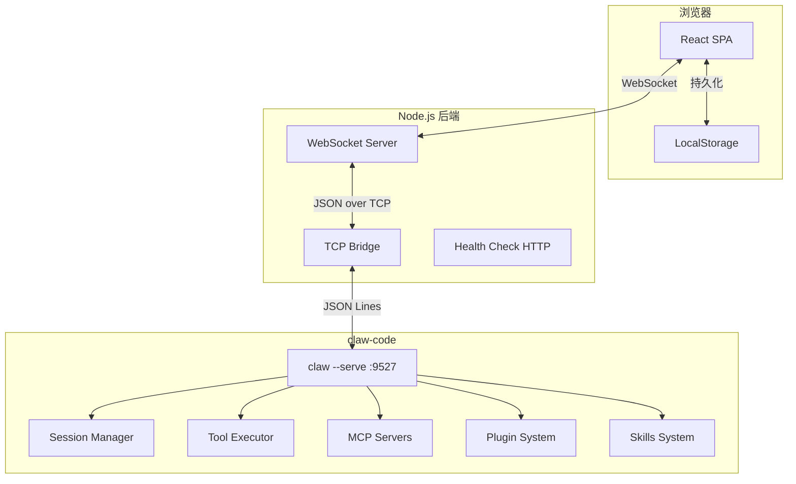
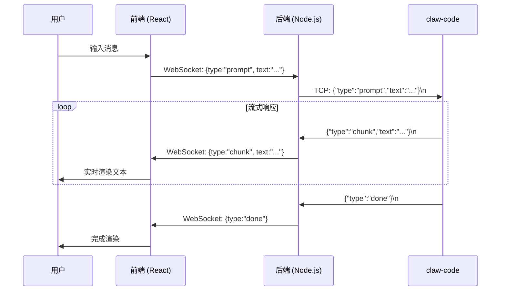
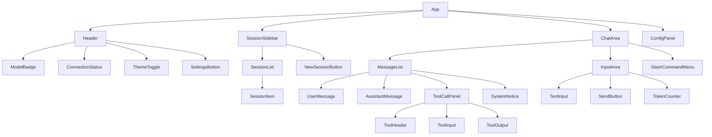

# Design Document: Claw Web Chat

## Overview

Claw Web Chat 是一个基于浏览器的 Web 聊天界面，通过 WebSocket 与后端服务通信，后端再通过 TCP 连接桥接到 claw-code 的 `--serve` 模式。系统采用三层架构：

1. **前端层 (React SPA)** — 提供聊天 UI、会话管理、配置面板
2. **后端层 (Node.js WebSocket Server)** — 管理 WebSocket 连接，桥接 TCP 协议
3. **claw-code 层** — 通过 `--serve` 模式提供 AI 对话能力

### 核心设计决策

| 决策 | 选择 | 理由 |
|------|------|------|
| 前端框架 | React + TypeScript | 组件化开发，生态成熟，类型安全 |
| 状态管理 | Zustand | 轻量、简洁，适合中等复杂度应用 |
| 后端运行时 | Node.js | 原生支持 WebSocket 和 TCP，与前端工具链统一 |
| 前后端通信 | WebSocket | 支持双向实时流式传输 |
| 样式方案 | Tailwind CSS | 快速开发，一致的设计系统 |
| Markdown 渲染 | react-markdown + rehype | 支持代码高亮、GFM 等扩展 |
| 构建工具 | Vite | 快速 HMR，开箱即用的 TypeScript 支持 |

## Architecture

### 系统架构图



### 数据流



### TCP 协议规范 (claw --serve)

基于对 `rust/crates/rusty-claude-cli/src/main.rs` 的分析，TCP 协议为 JSON Lines 格式（每行一个 JSON 对象，`\n` 分隔）：

**连接建立：**
- 客户端连接后，服务端发送 `{"type":"ready","model":"...","session_id":"..."}`

**客户端→服务端消息：**
| type | 字段 | 说明 |
|------|------|------|
| `prompt` | `text: string` | 发送用户消息 |
| `reset` | — | 清空会话历史 |
| `inject` | `messages: [{role, text}]` | 注入历史消息 |
| `exit` | — | 断开连接 |
| `history` | — | 获取提示历史 |

**服务端→客户端消息：**
| type | 字段 | 说明 |
|------|------|------|
| `ready` | `model, session_id` | 连接就绪 |
| `chunk` | `text: string` | 流式文本片段 |
| `done` | — | 回复完成 |
| `error` | `text: string` | 错误信息 |
| `usage` | token 统计 | Token 使用量 |
| `tool_start` | 工具信息 | 工具调用开始 |
| `reset_done` | `session_id` | 重置完成 |
| `inject_done` | `count` | 注入完成 |
| `history` | `messages: string[]` | 历史记录 |

## Components and Interfaces

### 前端组件层次



### 后端模块结构

```
backend/
├── src/
│   ├── index.ts              # 入口：HTTP + WebSocket 服务器
│   ├── ws-handler.ts         # WebSocket 连接管理
│   ├── tcp-bridge.ts         # TCP 桥接到 claw-code
│   ├── message-parser.ts     # JSON Lines 消息解析
│   ├── health.ts             # 健康检查端点
│   └── types.ts              # 共享类型定义
├── package.json
└── tsconfig.json
```

### 核心接口定义

```typescript
// === WebSocket 协议 (前端 ↔ 后端) ===

// 客户端 → 服务端
interface WsClientMessage {
  type: 'prompt' | 'reset' | 'inject' | 'slash_command' | 'connect_config';
  payload: PromptPayload | ResetPayload | InjectPayload | SlashPayload | ConfigPayload;
}

interface PromptPayload {
  text: string;
  sessionId: string;
}

interface ConfigPayload {
  baseUrl: string;
  model: string;
  apiKey?: string;
}

// 服务端 → 客户端
interface WsServerMessage {
  type: 'chunk' | 'done' | 'error' | 'ready' | 'tool_start' | 'tool_end' 
       | 'usage' | 'status' | 'reconnected';
  payload: any;
}

// === TCP Bridge 接口 ===
interface TcpBridge {
  connect(host: string, port: number): Promise<void>;
  sendPrompt(text: string): void;
  sendReset(): Promise<void>;
  sendInject(messages: InjectMessage[]): Promise<void>;
  onMessage(handler: (msg: TcpServerMessage) => void): void;
  disconnect(): void;
  isConnected(): boolean;
}
```

### 前端 Store 接口

```typescript
// Zustand Store
interface ChatStore {
  // 会话管理
  sessions: Session[];
  activeSessionId: string | null;
  createSession(): string;
  switchSession(id: string): void;
  deleteSession(id: string): void;
  renameSession(id: string, name: string): void;
  
  // 消息
  messages: Record<string, Message[]>;
  addMessage(sessionId: string, msg: Message): void;
  appendChunk(sessionId: string, msgId: string, text: string): void;
  
  // 连接状态
  connectionStatus: 'connected' | 'disconnected' | 'reconnecting';
  setConnectionStatus(status: string): void;
  
  // 配置
  config: AppConfig;
  updateConfig(config: Partial<AppConfig>): void;
  
  // 流式状态
  isStreaming: boolean;
  setStreaming(v: boolean): void;
}
```

## Data Models

### 会话模型 (Session)

```typescript
interface Session {
  id: string;                    // UUID v4
  name: string;                  // 用户自定义名称或自动生成
  createdAt: number;             // 创建时间戳 (ms)
  updatedAt: number;             // 最后更新时间戳 (ms)
  lastMessagePreview: string;    // 最后一条消息预览 (前50字符)
  messageCount: number;          // 消息数量
  unread: boolean;               // 是否有未读消息
  tokenUsage: TokenUsage;        // 累计 token 使用量
}

interface TokenUsage {
  inputTokens: number;
  outputTokens: number;
  estimatedCost: number;         // 估算费用 (USD)
}
```

### 消息模型 (Message)

```typescript
interface Message {
  id: string;                    // UUID v4
  sessionId: string;             // 所属会话 ID
  role: 'user' | 'assistant' | 'system';
  content: MessageContent[];     // 内容块列表
  timestamp: number;             // 时间戳 (ms)
  usage?: TokenUsage;            // 本次消息的 token 使用
  status: 'sending' | 'streaming' | 'complete' | 'error';
}

type MessageContent = 
  | { type: 'text'; text: string }
  | { type: 'tool_use'; id: string; name: string; input: string }
  | { type: 'tool_result'; toolUseId: string; toolName: string; output: string; isError: boolean };
```

### 配置模型 (AppConfig)

```typescript
interface AppConfig {
  activeProfile: string;         // 当前激活的配置档案
  profiles: ConfigProfile[];     // 配置档案列表
  theme: 'light' | 'dark';      // 主题
  sidebarWidth: number;          // 侧边栏宽度 (px)
  sidebarCollapsed: boolean;     // 侧边栏是否折叠
}

interface ConfigProfile {
  id: string;                    // 档案 ID
  name: string;                  // 档案名称
  baseUrl: string;               // API baseURL (后端地址)
  clawHost: string;              // claw-code TCP 主机
  clawPort: number;              // claw-code TCP 端口
  model: string;                 // 模型名称
  apiKey?: string;               // API Key (可选)
}
```

### 工具调用模型 (ToolCall)

```typescript
interface ToolCall {
  id: string;                    // 工具调用 ID
  name: string;                  // 工具名称 (如 "bash", "read_file", "mcp:server/tool")
  input: Record<string, any>;    // 工具输入参数
  output?: string;               // 工具输出
  isError: boolean;              // 是否出错
  status: 'running' | 'complete' | 'error';
  startTime: number;             // 开始时间
  endTime?: number;              // 结束时间
  collapsed: boolean;            // UI 折叠状态
}
```

### 斜杠命令模型

```typescript
interface SlashCommand {
  name: string;                  // 命令名 (不含 /)
  description: string;           // 命令描述
  handler: 'local' | 'remote';  // 本地处理或发送到后端
}

const SLASH_COMMANDS: SlashCommand[] = [
  { name: 'help', description: '显示帮助信息', handler: 'local' },
  { name: 'status', description: '显示连接状态和模型信息', handler: 'local' },
  { name: 'compact', description: '压缩会话上下文', handler: 'remote' },
  { name: 'clear', description: '清空当前会话', handler: 'local' },
  { name: 'cost', description: '显示 token 使用和费用', handler: 'local' },
  { name: 'skills', description: '列出可用技能', handler: 'remote' },
  { name: 'plugins', description: '列出已安装插件', handler: 'remote' },
  { name: 'mcp', description: '显示 MCP 服务器状态', handler: 'remote' },
  { name: 'version', description: '显示版本信息', handler: 'remote' },
  { name: 'export', description: '导出会话为 JSON', handler: 'local' },
];
```

### LocalStorage 持久化结构

```typescript
// Key: "claw-web-chat:sessions"
// Value: Session[]

// Key: "claw-web-chat:messages:{sessionId}"  
// Value: Message[]

// Key: "claw-web-chat:config"
// Value: AppConfig
```


## Correctness Properties

*A property is a characteristic or behavior that should hold true across all valid executions of a system—essentially, a formal statement about what the system should do. Properties serve as the bridge between human-readable specifications and machine-verifiable correctness guarantees.*

### Property 1: Session creation grows session list

*For any* session store with N sessions, creating a new session should result in exactly N+1 sessions, the new session should have a unique ID not present in the original list, and it should become the active session.

**Validates: Requirements 1.2**

### Property 2: Session deletion shrinks list and selects most recent

*For any* session store with more than one session, deleting a session should result in the session count decreasing by one, the deleted session ID should not exist in storage, and the active session should be the one with the most recent `updatedAt` timestamp among remaining sessions.

**Validates: Requirements 1.6**

### Property 3: Session switching displays correct history

*For any* set of sessions each with distinct message histories, switching to a session should make the displayed messages exactly equal to that session's stored message list.

**Validates: Requirements 1.3**

### Property 4: Session persistence round-trip

*For any* valid session object, serializing it to LocalStorage and then deserializing should produce an equivalent session object (same id, name, messages, timestamps, token usage).

**Validates: Requirements 1.4**

### Property 5: Unread indicator on inactive sessions

*For any* session that is not the active session, if a new message is added to it, the session's `unread` flag should be set to true. Conversely, switching to a session should set its `unread` flag to false.

**Validates: Requirements 1.7**

### Property 6: Configuration persistence round-trip

*For any* valid AppConfig object, saving to LocalStorage and loading back should produce an equivalent configuration (same profiles, theme, active profile).

**Validates: Requirements 2.2, 2.4**

### Property 7: URL validation correctness

*For any* string, the URL validator should return true if and only if the string matches a valid URL format (has protocol scheme, valid host). Specifically: all strings without a protocol prefix should be rejected, and all strings with valid `http://` or `https://` prefix followed by a valid host should be accepted.

**Validates: Requirements 2.3**

### Property 8: Profile switching updates active configuration

*For any* set of configuration profiles and any profile ID in that set, switching to that profile should update the active profile ID and the effective connection parameters (baseUrl, model, port) should match the selected profile's values.

**Validates: Requirements 2.7**

### Property 9: Streaming state machine transitions

*For any* message submission, the state should transition to `isStreaming=true` and input disabled. Upon receiving a `done` message, state should transition to `isStreaming=false` and input enabled. Upon receiving an `error` message, state should also transition to `isStreaming=false` and input enabled, with the error text stored in the last message.

**Validates: Requirements 3.1, 3.3, 3.4**

### Property 10: Chunk accumulation equals concatenation

*For any* sequence of chunk messages with text payloads [t1, t2, ..., tn], the final displayed assistant message text should equal the concatenation t1 + t2 + ... + tn.

**Validates: Requirements 3.2**

### Property 11: Markdown rendering preserves semantic content

*For any* markdown string, rendering it should produce output that contains all the original text content (stripped of markdown syntax). Code blocks should be wrapped in elements with language-specific class names.

**Validates: Requirements 3.5**

### Property 12: Tool call rendering completeness

*For any* tool_use content block with name N and input I, and its corresponding tool_result with output O, the rendered tool panel should contain the tool name N, a representation of input I, and the output O.

**Validates: Requirements 4.1, 4.2**

### Property 13: Tool calls maintain chronological order

*For any* list of tool call content blocks with timestamps [t1 < t2 < ... < tn], the rendered tool panels should appear in the same order as the input list.

**Validates: Requirements 4.5**

### Property 14: File content syntax highlighting by extension

*For any* tool_result containing file content with a recognized file extension (e.g., .ts, .py, .rs, .json), the rendered output should include syntax highlighting markup for the corresponding language.

**Validates: Requirements 4.6**

### Property 15: Bare-word skill resolution

*For any* input text that exactly matches a known skill name (alphanumeric, hyphens, underscores only), the backend should resolve it as a skill invocation and forward the expanded skill prompt to claw-code rather than the raw text.

**Validates: Requirements 5.1, 5.2**

### Property 16: Prefixed tool rendering for MCP and plugins

*For any* tool call where the tool name contains a namespace prefix (format "server_name/tool_name" for MCP or "plugin_name/tool_name" for plugins), the rendered tool panel should display the prefix as a distinct label before the tool name.

**Validates: Requirements 6.2, 6.5**

### Property 17: Token usage display accuracy

*For any* session with accumulated usage data (inputTokens, outputTokens), the status bar should display values that match the sum of all message-level usage in that session.

**Validates: Requirements 7.5**

### Property 18: New session starts with clean context

*For any* new session creation, the session should have zero messages, and a `reset` command should be sent to the TCP bridge to ensure claw-code also starts fresh.

**Validates: Requirements 7.6**

### Property 19: Slash command autocomplete filtering

*For any* input text starting with "/" followed by a prefix string P, the autocomplete dropdown should show exactly those commands whose names start with P (case-insensitive).

**Validates: Requirements 8.1**

### Property 20: Clear command resets session messages

*For any* session with N messages (N > 0), executing `/clear` should result in the session having zero displayed messages and a `reset` message sent to the TCP bridge.

**Validates: Requirements 8.3**

### Property 21: Export produces valid JSON with all messages

*For any* session with messages, the `/export` command should produce a valid JSON string that, when parsed, contains all message objects from the session with their roles, content, and timestamps preserved.

**Validates: Requirements 8.6**

### Property 22: Theme toggle persistence

*For any* current theme state (light or dark), toggling the theme should switch to the opposite value, persist it to storage, and on reload the persisted theme should be applied.

**Validates: Requirements 9.3**

### Property 23: Connection error contains failure reason

*For any* TCP connection failure with a specific error reason string, the error message displayed to the user should contain that reason string (or a user-friendly derivative of it).

**Validates: Requirements 2.6, 10.3**

### Property 24: Reconnection preserves session state

*For any* session state at the time of disconnection, after successful reconnection the session's message history and active session ID should remain unchanged.

**Validates: Requirements 10.1, 10.2**

## Error Handling

### 错误分类与处理策略

| 错误类型 | 来源 | 处理方式 | 用户提示 |
|----------|------|----------|----------|
| TCP 连接失败 | 后端→claw-code | 重试3次，间隔2s | "无法连接 claw-code，请确认已启动 --serve 模式" |
| WebSocket 断开 | 前端→后端 | 自动重连，5s间隔 | 状态栏显示 "Disconnected"，重连中显示动画 |
| 流式超时 | 120s 无数据 | 中断当前请求 | "请求超时，请重试" + 重试按钮 |
| JSON 解析错误 | TCP 消息格式 | 记录日志，跳过 | 不显示给用户，后端日志记录 |
| claw-code 错误 | `type:"error"` | 转发给前端 | 红色错误卡片显示错误文本 |
| LocalStorage 满 | 浏览器限制 | 提示用户清理旧会话 | "存储空间不足，请删除旧会话" |
| 配置无效 | URL 格式错误 | 阻止保存 | 输入框红色边框 + 错误提示 |

### 错误恢复机制

```typescript
// WebSocket 重连策略
const RECONNECT_CONFIG = {
  maxAttempts: Infinity,       // 无限重试
  baseDelay: 5000,             // 基础延迟 5s
  maxDelay: 30000,             // 最大延迟 30s
  backoffMultiplier: 1.5,      // 退避倍数
};

// TCP Bridge 重连策略
const TCP_RECONNECT_CONFIG = {
  maxAttempts: 3,              // 最多重试 3 次
  delay: 2000,                 // 固定延迟 2s
  onFailure: 'notify_user',   // 失败后通知用户手动检查
};
```

### 边界情况处理

1. **claw-code 进程崩溃** — TCP 连接断开，后端检测到并通知前端，前端显示重连提示
2. **并发消息** — 前端在流式响应期间禁用输入，防止并发请求
3. **超大响应** — 前端使用虚拟滚动，避免 DOM 节点过多导致性能问题
4. **网络抖动** — WebSocket 心跳检测 (30s ping/pong)，快速发现断连

## Testing Strategy

### 测试框架选择

| 层级 | 框架 | 用途 |
|------|------|------|
| 单元测试 | Vitest | 前端组件逻辑、工具函数 |
| 属性测试 | fast-check | 验证正确性属性 |
| 组件测试 | React Testing Library | UI 组件渲染和交互 |
| 集成测试 | Vitest + MSW | WebSocket 模拟、端到端流程 |
| E2E 测试 | Playwright (可选) | 关键用户流程 |

### 属性测试配置

- 使用 **fast-check** 库进行属性测试
- 每个属性测试最少运行 **100 次迭代**
- 每个测试用注释标注对应的设计文档属性编号
- 标签格式: `Feature: claw-web-chat, Property {number}: {property_text}`

### 测试分层策略

**单元测试 (Unit Tests)** — 具体示例和边界情况：
- 斜杠命令解析的具体输入输出
- 特定工具类型的渲染结果
- 特定 URL 格式的验证结果
- 健康检查端点的响应格式
- 超时处理的具体行为

**属性测试 (Property Tests)** — 通用属性验证：
- 会话 CRUD 操作的不变量 (Properties 1-5)
- 配置持久化的往返正确性 (Properties 6-8)
- 流式状态机的转换正确性 (Properties 9-10)
- 渲染函数的完整性 (Properties 11-14)
- 命令解析的正确性 (Properties 15, 19-21)

**集成测试** — 组件间协作：
- WebSocket 消息流转完整路径
- TCP Bridge 连接和消息转发
- 会话切换时的状态同步
- 重连后的状态恢复

### 关键测试场景

```typescript
// 示例：Property 4 - Session persistence round-trip
// Feature: claw-web-chat, Property 4: Session persistence round-trip
import fc from 'fast-check';

test('session persistence round-trip', () => {
  fc.assert(
    fc.property(
      arbitrarySession(),  // 生成随机 Session 对象
      (session) => {
        saveSessionToStorage(session);
        const loaded = loadSessionFromStorage(session.id);
        expect(loaded).toEqual(session);
      }
    ),
    { numRuns: 100 }
  );
});

// 示例：Property 10 - Chunk accumulation
// Feature: claw-web-chat, Property 10: Chunk accumulation equals concatenation
test('chunk accumulation equals concatenation', () => {
  fc.assert(
    fc.property(
      fc.array(fc.string({ minLength: 1 }), { minLength: 1 }),
      (chunks) => {
        const store = createTestStore();
        const msgId = store.startStreaming('session-1');
        for (const chunk of chunks) {
          store.appendChunk('session-1', msgId, chunk);
        }
        const finalText = store.getMessage('session-1', msgId).content[0].text;
        expect(finalText).toBe(chunks.join(''));
      }
    ),
    { numRuns: 100 }
  );
});
```
