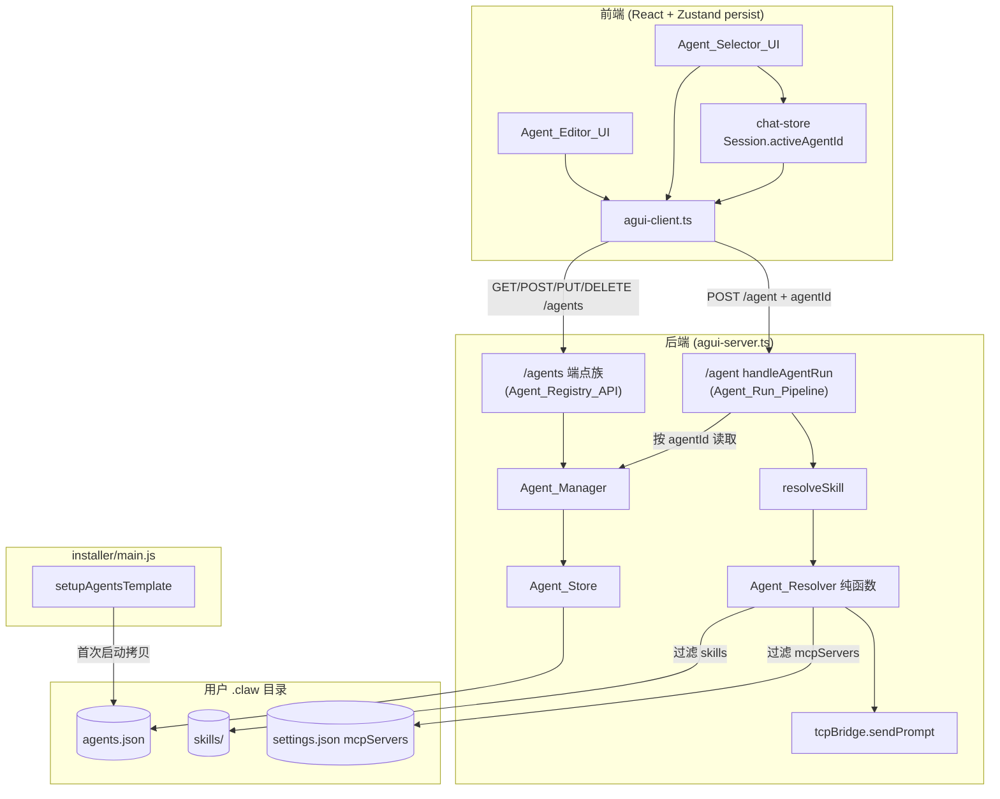

# 设计文档：自定义 Agent 管理（Phase 1）

## Overview

本设计为 Frontier 桌面应用引入显式的“自定义 Agent”实体，覆盖需求文档 Phase 1 全部范围：Agent 的 CRUD、列表与选择、按选中 Agent 配置运行对话、持久化、打包默认模板、以及安全与权限边界。Phase 2（A2A 协议）仅保留扩展点，不在本设计展开实现。

核心设计原则是**在不改动现有 `/agent` 主链路与事件协议、不破坏登录/TCP 连接流程的前提下增量叠加能力**：

- 新增能力走全新的 `/agents` REST 端点族，完全独立于现有端点。
- 现有 `/agent` 端点仅在请求体中**可选**新增 `agentId` 字段，缺省时行为与现状完全一致（向后兼容）。
- Agent 的“按配置运行”通过在 `Agent_Run_Pipeline` 的既有节点（`resolveSkill` 之后、`tcpBridge.sendPrompt` 之前）注入过滤与合并逻辑实现，AG-UI SSE 事件协议（`RUN_STARTED` / `TEXT_MESSAGE_*` / `TOOL_CALL_*` / `CUSTOM` / `RUN_FINISHED` 等）保持不变。
- 未选择 Agent（`Active_Agent` 为空）时，整条链路严格回退到 `Default_Behavior`，等价于功能引入前。

设计基于以下现有架构事实（已核对源码）：

- 后端 `agui-server.ts` 使用原生 `http.createServer` + `if/else` 路由分发；`handleAgentRun()` 调用 `resolveSkill(text, SKILLS_DIR)` 得到 prompt，再 `tcpBridge.sendPrompt()` 经 TCP(9527) 发给 claw-code。
- `resolveSkill()`（`ws-handler.ts`）按 skill 名读取 `~/.frontier-desktop/.claw/skills/<skill>/SKILL.md`（及可选 `AGENT_INSTRUCTIONS.md`）拼成 prompt 上下文。
- 模型与凭证经 `POST /config` → `ClawProcess.start()` 以 `--model` 参数与环境变量传入 claw-code；切换模型需重启 claw-code 进程。
- MCP 服务器配置位于 `~/.frontier-desktop/.claw/settings.json` 的 `mcpServers`；`installer/main.js` 的 `setupLocalMcpServers()` 与 `frontier-settings.json` 模板负责登记。
- 前端用 Zustand + `persist`（localStorage）管理 `sessions` / `messages` / `config`（多 profile）；`services/agui-client.ts` 是 SSE 客户端。

## Architecture

### 组件划分

后端（`claw-web-chat/backend/src`）新增三个模块：

- **Agent_Store**（`agent-store.ts`）：纯数据层。负责读写 `~/.frontier-desktop/.claw/agents.json`，原子写入（临时文件 + rename），解析失败降级为空列表且不覆盖原文件。提供序列化/反序列化、JSON 转义。无业务校验。
- **Agent_Manager**（`agent-manager.ts`）：业务逻辑层。CRUD、字段校验（name 必填、name 查重、agent_id 不变）、时间戳维护、agent_id 生成。依赖 Agent_Store 持久化。
- **Agent_Registry_API**：在 `agui-server.ts` 路由中新增 `/agents` 端点族（GET/POST/PUT/DELETE 分发到一个 `handleAgents()` 处理器），调用 Agent_Manager。

后端还在 `Agent_Run_Pipeline` 中新增一个纯函数模块：

- **Agent_Resolver**（`agent-resolver.ts`）：纯函数，输入 `(Agent_Definition | null, basePrompt, availableSkills, registeredMcpServers)`，输出 `{ promptWithInstructions, skillsToLoad, mcpServersToEnable, modelOverride, warnings }`。供 `handleAgentRun()` 调用，便于属性测试。

前端（`claw-web-chat/frontend/src`）：

- **Agent_Selector_UI**（`components/AgentSelector.tsx`）：展示 Agent 列表、显示当前选中 Agent 的 name、提供清除选择入口；空列表时显示提示并提供创建入口。放置在 `ConfigPanel` 附近。
- **Agent_Editor_UI**（`components/AgentEditor.tsx`）：创建/编辑/删除表单；技能与 MCP 多选；高风险 MCP 显示风险标识。
- **chat-store 扩展**：`Session` 增加可选字段 `activeAgentId`；新增 actions（`setActiveAgent` / `clearActiveAgent`）与 agent 列表缓存。
- **agui-client 扩展**：新增 `listAgents/getAgent/createAgent/updateAgent/deleteAgent` 方法；`sendPrompt` 增加可选 `agentId` 参数，随 `/agent` 请求体发送。

installer（`installer/main.js`）：

- **Agents_Template 拷贝**：新增 `setupAgentsTemplate()`，类比 `setupSkills()` / settings 合并逻辑，首次启动将 `agents.json` 模板拷贝到用户 `.claw` 目录，已存在则不覆盖。模板源文件随包分发（`installer/agents.template.json`，由 `make-installer.js` 拷入 release）。

### 组件关系图



### 关键架构决策

- **决策：新增 `/agents` 端点而非扩展 `/agent`。** 理由：`/agent` 是 SSE 流式主链路，混入 CRUD 会增加耦合与回归风险。独立 REST 端点边界清晰，满足 R6.2 协议向后兼容。
- **决策：Agent_Resolver 设计为纯函数。** 理由：skills/mcp 过滤与指令合并是本功能正确性核心，纯函数易于属性测试（R5、R9.4），且不持有状态、不触碰 TCP/SSE，符合 R5.6 不改事件协议。
- **决策：per-session 维度保存 `activeAgentId`（存于 `Session`，随 persist 落地）。** 理由：R4.4 要求不同会话可用不同 Agent；复用现有 `Session` 结构与 persist 机制，无需新存储。
- **决策：模型覆盖通过 `/config` 重连实现，非每条消息切换。** 见 Components 小节的权衡说明。

## Components and Interfaces

### Agent_Store（`agent-store.ts`）

纯数据访问层，路径解析与 `SKILLS_DIR` 一致：`CLAW_WORKSPACE ? join(CLAW_WORKSPACE, '.claw', 'agents.json') : join(process.cwd(), '.claw', 'agents.json')`。

```typescript
interface AgentStore {
  /** 读取全部 Agent。文件不存在或 JSON 解析失败 → 返回 []，记录日志，不抛出（R6.4, R7.4）。 */
  loadAll(): AgentDefinition[];

  /** 原子写入：写入临时文件 agents.json.tmp，再 fs.renameSync 覆盖（R7.5）。
   *  写入前用 JSON.stringify 序列化（自动 JSON 转义 name/description/extra_instructions，R9.5）。 */
  saveAll(agents: AgentDefinition[]): void;
}
```

降级语义：`loadAll()` 内部用 `try/catch` 包裹 `readFileSync` + `JSON.parse`；任何失败仅 `console.error` 并返回 `[]`。解析失败时**不写回**文件，保留用户原始字节，直到下一次成功 `saveAll()`（R7.4）。

### Agent_Manager（`agent-manager.ts`）

```typescript
interface AgentManager {
  list(): AgentDefinition[];                         // R2.1
  get(agentId: string): AgentDefinition | null;      // R2.4 / R2.5(null)
  create(input: AgentInput): Result<AgentDefinition>; // R1
  update(agentId: string, input: AgentInput): Result<AgentDefinition>; // R3.1/3.2/3.5
  remove(agentId: string): Result<void>;             // R3.3 / R3.5
}

type Result<T> =
  | { ok: true; value: T }
  | { ok: false; error: { code: AgentErrorCode; message: string; field?: string } };

type AgentErrorCode =
  | 'MISSING_NAME'        // R1.4
  | 'DUPLICATE_NAME'      // R1.5
  | 'NOT_FOUND'           // R2.5 / R3.5
  | 'INVALID_MCP';        // R9.1 引用未登记 MCP
```

校验规则：

- `create`：`name` 去空白后非空，否则 `MISSING_NAME`（R1.4）；`name` 与现有 Agent 不重复（大小写敏感、trim 后比较），否则 `DUPLICATE_NAME`（R1.5）；生成 `agent_id = crypto.randomUUID()`（R1.2）；`created_at = updated_at = Date.now()`（R1.3）。
- `update`：按 `agent_id` 查找，不存在则 `NOT_FOUND` 且不改动 Store（R3.5）；保留原 `agent_id` 与 `created_at`，刷新 `updated_at`（R3.1/3.2）；改名时同样查重（排除自身）。
- `remove`：不存在则 `NOT_FOUND`（R3.5）；存在则从列表移除并 `saveAll`（R3.3）。会话回退（R3.4）由前端处理：删除成功后前端清除引用该 agent 的 `activeAgentId`。
- **MCP 登记校验（R9.1）**：`create`/`update` 校验 `enabled_mcp_servers` 中每一项都存在于 `settings.json` 的 `mcpServers` key 集合中；存在未登记项则 `INVALID_MCP`。**不限制高风险 MCP**——高风险 MCP 只要已登记即允许启用（R9.2）。

### Agent_Registry_API（`agui-server.ts` 路由）

在现有 `if/else` 路由链中，所有 `/agents` 与 `/agents/<id>` 请求路由到 `handleAgents(req, res)`，内部按 method 分发：

| Method | Path | 处理 | 成功响应 | 错误码 |
|---|---|---|---|---|
| GET | `/agents` | `list()` | `200 { agents: [...] }` | — |
| GET | `/agents/{id}` | `get(id)` | `200 { agent }` | `404 NOT_FOUND` |
| POST | `/agents` | `create(body)` | `201 { agent }` | `400 MISSING_NAME` / `409 DUPLICATE_NAME` / `400 INVALID_MCP` |
| PUT | `/agents/{id}` | `update(id, body)` | `200 { agent }` | `404` / `409` / `400` |
| DELETE | `/agents/{id}` | `remove(id)` | `200 { status:'ok' }` | `404` |

统一错误响应体：`{ error: { code, message, field? } }`。所有响应均 `setCorsHeaders(res)`，与现有端点一致。这些端点**不依赖 TCP 连接**（纯文件操作），即使 claw-code 未连接也能管理 Agent。

### Agent_Run_Pipeline 注入（`handleAgentRun` + `Agent_Resolver`）

`POST /agent` 请求体新增可选 `agentId`。`handleAgentRun()` 改动点（最小侵入）：

```typescript
const { threadId, runId, messages, agentId } = body;   // 新增 agentId（可选）
// ... 既有逻辑不变 ...
const basePrompt = resolveSkillForAgent(lastUserMsg.content, agentId);
```

其中按 `agentId` 解析：

1. `agentId` 为空 → `Active_Agent` 为空 → 走 `Default_Behavior`：直接 `resolveSkill(content, SKILLS_DIR)`，不做任何过滤（R6.1）。
2. `agentId` 非空 → `agentManager.get(agentId)`：
   - 取不到（已被删除）→ 记录警告，回退 `Default_Behavior`（与 R3.4 协同）。
   - 取到 → 调用纯函数 `Agent_Resolver` 计算运行参数。

**Agent_Resolver 纯函数职责（R5、R9.4、R6.5）：**

```typescript
interface AgentRunPlan {
  prompt: string;            // basePrompt 前置注入 extra_instructions
  skillsToLoad: string[];    // enabled_skills ∩ 实际存在的 skills（缺失项跳过）
  mcpServersToEnable: string[]; // enabled_mcp_servers ∩ 已登记 mcpServers（缺失项跳过）
  modelOverride: string | null; // agent.model 或 null（用 profile 默认）
  warnings: string[];        // 跳过的缺失 skill/mcp（R6.5）
}

function planAgentRun(
  agent: AgentDefinition | null,
  basePromptContent: string,
  availableSkills: string[],
  registeredMcpServers: string[],
): AgentRunPlan;
```

- **extra_instructions 合并（R5.1, R9.4）**：在 `resolveSkill` 产出的 skill 上下文之上，按固定顺序拼装最终 prompt：

  ```
  [系统级安全指令 / 既有 instructions]      ← 最高优先级，不可被覆盖
  ---
  [用户级 Agent 附加指令: extra_instructions] ← 注入为用户级，明确标注
  ---
  [skill 上下文 + 用户消息]
  ```

  `extra_instructions` 以明确的“用户级附加指令”包裹块注入，置于系统级安全指令**之后**，保证系统级指令优先级（R9.4）。系统级安全指令本身由 claw-code 侧的既有 instructions 提供，本功能不删改它。

- **仅加载 enabled_skills（R5.2）**：`resolveSkill` 当前按输入文本匹配 `KNOWN_SKILLS`。本设计将 skill 过滤上移到 Agent_Resolver：当存在 Active_Agent 时，仅当匹配到的 skill ∈ `enabled_skills` 时才注入该 skill 上下文；不在列表中的 skill 不注入。`enabled_skills` 中引用了不存在的 skill 目录时，跳过并加入 `warnings`（R6.5）。

- **仅启用 enabled_mcp_servers（R5.3）**：MCP 启用集随本次 run 传给 claw-code。实现见下方“MCP 过滤机制”。

- **model 覆盖（R5.4/5.5）**：`agent.model` 非空则 `modelOverride = agent.model`；否则 `null`，使用当前 profile 默认模型。

#### MCP 过滤机制（在不破坏 TCP/SSE 链路前提下）

claw-code 从 `cwd/.claw/settings.json` 读取 `mcpServers`，并在进程启动时初始化 MCP。运行期单条消息无法热切换已初始化的 MCP 集合。因此采用**“按需重连 + 设置覆盖”**策略，与现有 `/config` 重启机制一致：

- 维护一个进程级 `currentRunContext`，记录当前 claw-code 实例生效的 `{ model, enabledMcpServers }` 指纹。
- `handleAgentRun` 在发送 prompt 前比较目标 Plan 的 `{ modelOverride, mcpServersToEnable }` 与 `currentRunContext`：
  - **一致** → 直接 `tcpBridge.sendPrompt(plan.prompt)`，零额外开销（最常见路径）。
  - **不一致** → 先写出一份**派生 settings**（仅含 `mcpServersToEnable` 子集的 `mcpServers`）到 claw-code 工作区的 settings.json（原子写），再以 `modelOverride` 重启 claw-code（复用 `clawProcess.stop()/start()` + `tcpBridge` 重连，与 `handleConfig` 路径相同），重连成功后再 `sendPrompt`。
- `Default_Behavior`（无 Active_Agent）使用完整 `settings.json` 与 profile 默认模型；切回时同样按指纹判断是否需要恢复。

该机制完全复用既有进程/TCP 生命周期代码，不新增事件类型，SSE 仍由既有 `onMessage` 流程产出（R5.6）。代价是切换 Agent 时首条消息有一次重连延迟；同一 Agent 连续对话无额外开销。

> 权衡说明：相比“为每个 Agent 常驻一个 claw-code 进程”，单进程按需重连显著降低资源占用与复杂度，且与现有 `/cancel`、自动重启逻辑天然兼容。重连延迟仅在切换 Agent/模型/MCP 集时发生。

### 前端组件与接口

**chat-store 扩展**（`Session` 增加可选字段，向后兼容 persist）：

```typescript
interface Session {
  // ...既有字段...
  activeAgentId?: string | null; // 该会话选中的 Agent，缺省/ null = Default_Behavior
}

// 新增 actions
setActiveAgent(sessionId: string, agentId: string | null): void; // R4.1/4.3
// 缓存的 agent 列表（非 persist，启动时从后端拉取）
agents: AgentDefinition[];
refreshAgents(): Promise<void>;
```

**agui-client 扩展**：

```typescript
listAgents(): Promise<AgentDefinition[]>;
getAgent(id: string): Promise<AgentDefinition>;
createAgent(input: AgentInput): Promise<AgentDefinition>;
updateAgent(id: string, input: AgentInput): Promise<AgentDefinition>;
deleteAgent(id: string): Promise<void>;
// sendPrompt 增加可选 agentId，并入 /agent 请求体
sendPrompt(text: string, sessionId: string, agentId?: string | null): Promise<void>;
```

`sendPrompt` 发送时从当前 `Session.activeAgentId` 读取并附加到请求体；为空则不附加（向后兼容）。

**Agent_Selector_UI**：列出每个 Agent 的 name + description（R2.2）；高亮当前 `activeAgentId` 并显示其 name（R4.2）；提供“清除选择 → Default_Behavior”入口（R4.3）；列表为空时显示空状态提示 + “创建 Agent”按钮（R2.3）。

**Agent_Editor_UI**：表单字段对应 `AgentInput`；`enabled_skills` 从后端可用 skills 多选；`enabled_mcp_servers` 从已登记 `mcpServers` 多选；对标记为高风险的 MCP（见数据模型 `highRiskMcpServers`）显示醒目风险标识（图标/颜色/提示文案），用户可勾选启用但需知情确认，**不阻止启用**（R9.3）。删除成功后若删除的是某会话的 `activeAgentId`，前端将该会话 `activeAgentId` 置空回退（R3.4）。

### installer 模板拷贝（`setupAgentsTemplate`）

```javascript
// installer/main.js，在 setupSkills/settings 合并附近调用
function setupAgentsTemplate() {
  const src = path.join(APP_DIR, 'agents.template.json');     // 随包分发
  const dst = path.join(USER_DATA, '.claw', 'agents.json');
  if (!fs.existsSync(src)) return;                            // 无模板则跳过
  fs.mkdirSync(path.dirname(dst), { recursive: true });
  if (fs.existsSync(dst)) return;                             // 已存在不覆盖（R8.3）
  fs.copyFileSync(src, dst);                                  // 首次拷贝（R8.2）
  log('Agents template copied to .claw/agents.json');
}
```

`make-installer.js` 增加将 `installer/agents.template.json` 拷入 release 目录（与 `frontier-settings.json` 同级，R8.1）。

## Data Models

### agents.json 顶层结构

```json
{
  "version": 1,
  "agents": [ /* AgentDefinition[] */ ],
  "highRiskMcpServers": ["pcdmis"]
}
```

- `version`：schema 版本，便于未来迁移。
- `agents`：Agent_Definition 数组。
- `highRiskMcpServers`：被标记为高风险的 MCP server key 列表（如可驱动 PC-DMIS 真实 CMM 硬件运动的 `pcdmis`）。前端据此显示风险标识（R9.3）。该字段为元数据，不影响是否允许启用。

### AgentDefinition

```typescript
interface AgentDefinition {
  agent_id: string;            // 全局唯一，UUID v4，创建后不可变（R1.2, R3.2）
  name: string;               // 必填、唯一（R1.4, R1.5）
  description: string;        // 可选，默认 ""
  extra_instructions: string; // 可选，用户级附加指令，默认 ""（R5.1, R9.4）
  enabled_skills: string[];   // skill 目录名列表（R5.2）
  enabled_mcp_servers: string[]; // 已登记的 mcpServers key 列表（R5.3, R9.1）
  model: string | null;       // 模型覆盖；null = 用 profile 默认（R5.4, R5.5）
  created_at: number;         // epoch ms（R1.3）
  updated_at: number;         // epoch ms（R1.3, R3.1）
}

// 创建/更新输入（不含服务端管理字段）
interface AgentInput {
  name: string;
  description?: string;
  extra_instructions?: string;
  enabled_skills?: string[];
  enabled_mcp_servers?: string[];
  model?: string | null;
}
```

### agents.json 示例

```json
{
  "version": 1,
  "highRiskMcpServers": ["pcdmis"],
  "agents": [
    {
      "agent_id": "a1b2c3d4-0001-4abc-8def-000000000001",
      "name": "计量助手",
      "description": "只读分析 CMM 测量数据，不驱动硬件",
      "extra_instructions": "你是计量数据分析助手，只读分析结果，遇到硬件运动请求时拒绝并提醒用户。",
      "enabled_skills": ["sysinfo"],
      "enabled_mcp_servers": ["metrology", "filesystem"],
      "model": null,
      "created_at": 1735660000000,
      "updated_at": 1735660000000
    },
    {
      "agent_id": "a1b2c3d4-0002-4abc-8def-000000000002",
      "name": "PC-DMIS 操作员",
      "description": "可驱动真实 CMM 硬件，谨慎使用",
      "extra_instructions": "执行测量程序前先复述将要进行的运动步骤。",
      "enabled_skills": ["pc-dmis-automation"],
      "enabled_mcp_servers": ["pcdmis", "filesystem"],
      "model": "anthropic/claude-sonnet-4",
      "created_at": 1735660100000,
      "updated_at": 1735660100000
    }
  ]
}
```


## Correctness Properties

*属性（property）是指在系统所有有效执行路径上都应成立的特征或行为——本质上是关于系统应该做什么的形式化陈述。属性是人类可读规格与机器可验证正确性保证之间的桥梁。*

以下属性基于对验收标准的可测性预分析（prework）并经过冗余消除得到。每条属性均为全称量化陈述，并标注其验证的需求条款。

### Property 1: Agent 持久化 round-trip

*对任意* 有效的 Agent_Definition 集合，先通过 Agent_Store `saveAll` 写入，再用一个新的 Agent_Store 实例 `loadAll`（或经 Agent_Manager 的 `list` / `get(agent_id)`），取回的集合应与写入的集合逐字段等价（包含 agent_id、时间戳与所有可配置字段）。

**Validates: Requirements 1.1, 1.6, 2.1, 2.4, 7.1, 7.2, 7.3**

### Property 2: 特殊字符序列化转义安全

*对任意* 字符串（包含双引号、反斜杠、换行、制表符与非 ASCII Unicode 字符）作为 name、description 或 extra_instructions，`saveAll` 后 `loadAll` 取回的对应字段应与原字符串完全相等，且写出的 `agents.json` 始终是合法可解析的 JSON。

**Validates: Requirements 9.5**

### Property 3: 缺失 name 被拒绝

*对任意* name 为空或仅由空白字符组成的 AgentInput，`create` 应返回 `MISSING_NAME` 错误，且 Agent_Store 内容保持不变。

**Validates: Requirements 1.4**

### Property 4: name 唯一性

*对任意* 已存在的 Agent_Definition，使用与其相同的 name（trim 后比较）执行 `create`，或将另一个 Agent 通过 `update` 改名为该 name，都应返回 `DUPLICATE_NAME` 错误，且 Agent 总数不变。

**Validates: Requirements 1.5, 3.1**

### Property 5: 创建不变量（唯一 id 与时间戳）

*对任意* 一组连续的 `create` 操作，所有生成的 agent_id 应两两不同，且每个新建 Agent 的 created_at 与 updated_at 均被赋值为正数时间戳并相等。

**Validates: Requirements 1.2, 1.3**

### Property 6: 更新不变量（id 不变、时间戳前进）

*对任意* 已存在的 Agent_Definition 与任意有效修改，`update` 后该 Agent 的 agent_id 与 created_at 应保持不变，updated_at 应不早于修改前的值，且被修改字段已生效。

**Validates: Requirements 3.1, 3.2**

### Property 7: 删除移除

*对任意* 已存在的 Agent_Definition，`remove` 后 `list` 中不再包含该 agent_id，且 Agent 总数恰好减一。

**Validates: Requirements 3.3**

### Property 8: 不存在 id 的错误条件与不变量

*对任意* 不存在于 Agent_Store 的 agent_id，`get` 应返回未找到（null），`update` 与 `remove` 应返回 `NOT_FOUND` 错误，且 Agent_Store 内容保持不变。

**Validates: Requirements 2.5, 3.5**

### Property 9: 当前 Agent 选择一致性与会话隔离

*对任意* 会话集合，对某会话调用 `setActiveAgent(sessionId, agentId)` 后该会话的 activeAgentId 等于 agentId，调用 `setActiveAgent(sessionId, null)` 后其 activeAgentId 为空；且对一个会话的设置不改变其他任何会话的 activeAgentId。

**Validates: Requirements 4.1, 4.3, 4.4**

### Property 10: 删除当前 Agent 触发会话回退

*对任意* 会话集合，删除某个 Agent 后，所有原先 activeAgentId 指向该 Agent 的会话其 activeAgentId 应被清空（回退到 Default_Behavior），其余会话不受影响。

**Validates: Requirements 3.4**

### Property 11: extra_instructions 作为用户级注入且系统指令优先

*对任意* 含非空 extra_instructions 的 Active_Agent，`planAgentRun` 产出的最终 prompt 应包含该 extra_instructions，且系统级安全指令块在文本顺序上出现在 extra_instructions 之前（系统级优先级被保留）。

**Validates: Requirements 5.1, 9.4**

### Property 12: 仅加载启用的 skills

*对任意* Active_Agent 与任意可用 skills 集合，`planAgentRun` 产出的 skillsToLoad 应是 enabled_skills 与实际存在 skills 的交集，绝不包含任何不在 enabled_skills 中的 skill。

**Validates: Requirements 5.2**

### Property 13: 仅启用登记且选中的 MCP

*对任意* Active_Agent 与任意已登记 mcpServers 集合，`planAgentRun` 产出的 mcpServersToEnable 应是 enabled_mcp_servers 与已登记 mcpServers 的交集，绝不包含未启用或未登记的 MCP。

**Validates: Requirements 5.3**

### Property 14: 模型覆盖选择

*对任意* Active_Agent，当其 model 非空时 `planAgentRun` 的 modelOverride 等于该 model；当其 model 为空时 modelOverride 为 null（表示使用当前 profile 默认模型）。

**Validates: Requirements 5.4, 5.5**

### Property 15: 无 Active_Agent 等价于 Default_Behavior

*对任意* 用户消息内容，当 Active_Agent 为空（agentId 缺省）时，`planAgentRun` 产出的 prompt 应等于基线 `resolveSkill` 的结果、skillsToLoad/mcpServersToEnable 不施加 Agent 过滤、modelOverride 为 null，与本功能引入前的行为等价。

**Validates: Requirements 6.1, 6.2**

### Property 16: 读取/解析失败降级且不覆盖原文件

*对任意* 不存在、不可读或内容非法 JSON 的 agents.json，`loadAll` 应返回空列表且不抛出异常；当内容非法时，原文件字节应保持不变（不被空列表覆盖），直到下一次成功 `saveAll`。

**Validates: Requirements 6.4, 7.4**

### Property 17: 缺失引用跳过并告警

*对任意* 引用了不存在 skill 或未登记 MCP 的 Active_Agent，`planAgentRun` 应跳过这些缺失项、在 warnings 中记录对应告警，并仍为存在的项产出有效的运行计划。

**Validates: Requirements 6.5**

### Property 18: 写入完整性（原子写）

*对任意* Agent_Definition 集合序列，依次 `saveAll` 后，任意时刻从磁盘读取 agents.json 都应得到一个合法可解析的 JSON（不出现半写/损坏状态）。

**Validates: Requirements 7.5**

### Property 19: 模板拷贝幂等且不覆盖

*对任意* 目标 agents.json 状态：当目标不存在时 `setupAgentsTemplate` 后目标存在且内容等于模板；当目标已存在（任意内容）时运行后内容保持不变；重复运行该函数结果保持一致（幂等）。

**Validates: Requirements 8.2, 8.3**

### Property 20: MCP 登记边界（当且仅当全部已登记才允许）

*对任意* AgentInput，`create` 与 `update` 成功当且仅当其 enabled_mcp_servers 中的每一项都存在于 settings.json 已登记的 mcpServers 中（高风险 MCP 只要已登记即被允许）；若存在任何未登记项则返回 `INVALID_MCP` 且 Agent_Store 不变。

**Validates: Requirements 9.1, 9.2**

## Error Handling

后端错误分层处理，保证任何 Agent 相关失败都不阻断 Default_Behavior 下的核心对话：

- **Agent_Store 读取/解析失败（R6.4, R7.4）**：`loadAll` 内部 try/catch，失败时 `console.error` 记录并返回 `[]`；解析失败时**不写回**，保留用户原始文件字节。后续对话在无 Agent 列表下照常运行。
- **Agent_Store 写入失败**：`saveAll` 先写临时文件 `agents.json.tmp` 再 `renameSync`；若写临时文件或 rename 抛错，捕获后向上层返回错误，原 `agents.json` 不受影响（原子性，R7.5）。
- **Agent_Manager 业务错误**：以 `Result<T>` 的 `{ ok:false, error }` 返回，由 `handleAgents` 映射为对应 HTTP 状态码（400/404/409）与统一错误体 `{ error: { code, message, field? } }`，不抛出未捕获异常。
- **运行期 agentId 不存在（已被删除）**：`handleAgentRun` 取不到 Agent 时记录警告并回退 Default_Behavior，不中断本次 run。
- **缺失 skill/mcp 引用（R6.5）**：`Agent_Resolver` 跳过缺失项、写入 warnings；warnings 可作为 `CUSTOM` 事件透出给前端提示，但不属于必须的事件协议变更。
- **MCP 切换重连失败**：若按需重启 claw-code 失败，复用现有 `/config` 失败处理路径（重试一次，仍失败则返回 `RUN_ERROR`），不影响 Agent_Store 数据。
- **路由层兜底**：`agui-server` 既有顶层 try/catch 对所有请求返回 500，`/agents` 端点纳入同一兜底。

输入清洗：name/description/extra_instructions 作为纯文本由 `JSON.stringify` 序列化，天然完成 JSON 转义（R9.5）；不对 extra_instructions 做指令层解析，仅作为用户级文本注入（R9.4）。

## Testing Strategy

采用单元测试与基于属性的测试（PBT）双轨并行，二者互补：单元测试覆盖具体示例、UI 渲染与边界/错误情形，属性测试覆盖全称属性在大量随机输入下的成立性。

### 属性测试（Property-Based Testing）

- **库选型**：后端为 TypeScript/Node，采用 **fast-check** 配合现有测试框架（Vitest，与 `chat-store.test.ts` 一致），不自行实现属性测试框架。
- **迭代次数**：每个属性测试至少运行 100 次随机用例（fast-check `numRuns: 100` 或更高）。
- **单一映射**：上文每条 Correctness Property 由**单个**属性测试实现。
- **标签格式**：每个属性测试以注释标注 `Feature: custom-agent-management, Property {number}: {property_text}`。
- **生成器**：
  - `AgentInput` 生成器：随机 name（含空白串用于 P3）、description、extra_instructions（含特殊字符/Unicode 用于 P2/P11）、enabled_skills、enabled_mcp_servers、model（含 null）。
  - 临时文件系统：在 `os.tmpdir()` 下为每个用例创建隔离目录承载 agents.json，保证 P1/P2/P16/P18/P19 的文件级测试可重复且互不干扰。
  - 损坏内容生成器：随机非法 JSON 字节序列用于 P16。
- **覆盖映射**：P1–P20 对应实现位置：
  - Agent_Store（纯数据层）：P1, P2, P16, P18。
  - Agent_Manager（业务层）：P3, P4, P5, P6, P7, P8, P20。
  - Agent_Resolver（纯函数）：P11, P12, P13, P14, P15, P17。
  - chat-store（前端状态）：P9, P10。
  - installer setupAgentsTemplate：P19。

### 单元测试

聚焦属性测试不便覆盖的具体点，保持精简（避免用单元测试堆叠大量输入）：

- **UI 渲染示例**：Agent_Selector_UI 渲染包含 name/description（R2.2）、空列表显示提示与创建入口（R2.3）、存在 Active_Agent 时显示其 name（R4.2）；Agent_Editor_UI 对高风险 MCP 渲染风险标识且仍可勾选（R9.3）。
- **集成点**：`handleAgents` 各 method 的状态码与错误体映射；`handleAgentRun` 在带/不带 agentId 时分别走过滤路径与 Default_Behavior 路径；MCP 指纹一致时不触发重连、不一致时触发重连的判定。
- **构建期检查**：release 产物包含 `agents.template.json`（R8.1）。
- **边界/错误**：agents.json 缺失/损坏时端点与对话的降级行为冒烟测试。

## Phase 2（A2A）扩展点（仅预留，不实现）

为降低未来接入 A2A 协议的改造成本，本设计预留以下扩展点，Phase 1 不实现其逻辑：

- **AgentDefinition 可扩展元数据**：`agents.json` 的 `version` 字段为未来 schema 迁移留出空间；Agent_Definition 未来可新增可选 `agent_card`（描述能力与端点，对应 R10.1），现有读写以“未知字段保留透传”方式向前兼容。
- **调用权限策略钩子**：Agent_Manager 预留一个策略接口位置（如 `canInvoke(callerAgentId, calleeAgentId): boolean`），Phase 2 用于 A2A 调用校验（R10.2）与最小权限原则（R10.4）。Phase 1 不挂载任何实现。
- **高风险操作放行钩子**：`Agent_Resolver` / 运行链路预留 `highRiskMcpServers` 标记（已在数据模型中存在），Phase 2 可据此在驱动真实 CMM 硬件运动前要求 Clearance_Token 与人在回路确认（R10.3）。Phase 1 仅用于前端风险标识展示。

这些扩展点均为接口/字段层面的预留，不引入新的运行时行为，不影响 Phase 1 的任何属性与向后兼容保证。
