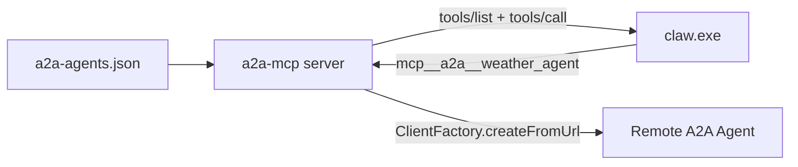
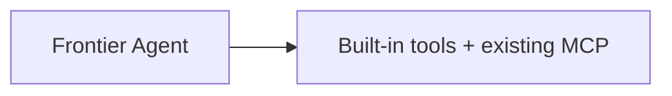

# Frontier A2A & External Agent Integration Guide

> **For claw.exe (Rust) developers:** The **primary integration path** is **direct function-calling tool registration inside claw.exe** — see the Chinese guide [`README.zh-CN.md`](./README.zh-CN.md) and [`claw-rust-integration.md`](./claw-rust-integration.md).  
> The MCP add-on path (Path A) below is an **alternative** when you cannot modify the claw binary.

This guide explains how to add **optional** remote agent delegation to the Frontier Agent, including:

1. **Native A2A agents** — discovered via Agent Card, delegated over the A2A protocol
2. **OpenAI-compatible external agents** — FastGPT, Dify, etc., routed through a backend security proxy
3. **Task progress tracking** — stream `status-update` / `artifact-update` events and surface progress in tool output

> **Core principle:** Both integrations are **add-ons with zero side effects**. When config files are missing or `agents` is empty, Frontier behaves exactly as it does today.

---

## Table of Contents

1. [Architecture Overview](#architecture-overview)
2. [Frontier Today (Baseline)](#frontier-today-baseline)
3. [Quick Start](#quick-start)
4. [Part 1 — Native A2A Agents](#part-1--native-a2a-agents)
5. [Part 2 — OpenAI-Compatible External Agents](#part-2--openai-compatible-external-agents)
6. [Task Progress & Task Management](#task-progress--task-management)
7. [Integration Paths for Frontier](#integration-paths-for-frontier)
8. [Testing Checklist](#testing-checklist)
9. [Troubleshooting](#troubleshooting)
10. [File Reference](#file-reference)

---

## Architecture Overview

### Native A2A flow (recommended for A2A-compliant agents)



### External agent flow (FastGPT, Dify, etc.)

```mermaid
flowchart LR
    Client[Frontier / Orchestrator]
    Proxy[Backend Proxy /api/v1/proxy/agent/:id/chat]
    External[External Platform API]

    Client -->|Internal payload| Proxy
    Proxy -->|OpenAI payload + API key| External
    External -->|choices[0].message.content| Proxy
    Proxy -->|reply + status| Client
```

**Security rule:** Third-party API keys **never** reach the frontend. All external traffic goes through the backend proxy.

### Disabled state (no side effects)



When `agents: []` or config files are missing, nothing changes.

---

## Frontier Today (Baseline)

Frontier's released backend (`D:\Work Projects\Frontier\backend-dist\backend\src`) is a **protocol bridge**, not the agent core:

| Layer | Role |
|-------|------|
| `agui-server.js` | HTTP/SSE API, maps TCP events → AG-UI events |
| `claw-process.js` | Spawns `claw.exe` with API key / model env vars |
| `claw.exe` | LLM + function calling + MCP tool execution |
| `.claw/settings.json` | MCP server registry (`mcpServers`) |

**Tool registration lives in `claw.exe` via MCP**, not in Node. Existing MCP servers (`metrology-mcp.exe`, `pcdmis-mcp.exe`) are the precedent for the A2A add-on.

Relevant Frontier files:

| File | Purpose |
|------|---------|
| `Frontier/main.js` | Launcher, MCP auto-registration in `setupLocalMcpServers()` |
| `Frontier/frontier-settings.json` | Default MCP template |
| `%APPDATA%/frontier-desktop/.claw/settings.json` | Live MCP config |
| `Frontier/backend-dist/backend/src/agui-server.js` | Agent HTTP API (`POST /agent` SSE) |

---

## Quick Start

### 1. Install dependencies (Agent2Agent repo)

```powershell
cd "D:\Work Projects\Agent2Agent"
npm install
```

### 2. Start sample A2A agents

```powershell
# Terminal 1
npx tsx weather_agent.ts

# Terminal 2
npx tsx file_write_agent.ts
```

### 3. Copy config

```powershell
$clawDir = "$env:APPDATA\frontier-desktop\.claw"
New-Item -ItemType Directory -Force -Path $clawDir | Out-Null
Copy-Item docs\frontier-a2a-integration\a2a-agents.example.json "$clawDir\a2a-agents.json"
```

### 4. Test the MCP server locally

```powershell
$env:A2A_CONFIG_PATH = ".\docs\frontier-a2a-integration\a2a-agents.example.json"
npx tsx docs\examples\a2a-mcp-server.ts
```

### 5. Test direct LangChain integration

```powershell
$env:A2A_CONFIG_PATH = ".\docs\frontier-a2a-integration\a2a-agents.example.json"
npx tsx docs\examples\direct-agent-integration.ts
```

---

## Part 1 — Native A2A Agents

### Config file

**Path priority:**

1. Function argument `configPath`
2. Environment variable `A2A_CONFIG_PATH`
3. Default: `{CLAW_WORKSPACE}/.claw/a2a-agents.json`

**Example:** [`a2a-agents.example.json`](./a2a-agents.example.json)

```json
{
  "agents": [
    {
      "id": "weather",
      "type": "native",
      "url": "http://localhost:4000",
      "enabled": true
    }
  ],
  "webhook": {
    "enabled": false,
    "url": "http://localhost:5000/webhook/task-updates",
    "token": "orchestrator-webhook-token"
  },
  "options": {
    "connectTimeoutMs": 5000,
    "failFast": false
  }
}
```

| Field | Required | Notes |
|-------|----------|-------|
| `agents[].url` | Yes | **Base URL only** — SDK fetches `/.well-known/agent-card.json` |
| `agents[].enabled` | No | Default `true`; `false` skips the agent |
| `options.failFast` | No | `true` = abort if any agent unreachable; `false` = skip failed agents |
| `webhook.enabled` | No | Attach push notification config to delegate requests |

### How clients are created

```typescript
import { ClientFactory } from "@a2a-js/sdk/client";

const factory = new ClientFactory();
const client = await factory.createFromUrl("http://localhost:4000");
const card = await client.getAgentCard();
// card.name, card.description, card.skills → used for tool registration
```

See [`docs/examples/a2a-config-loader.ts`](../examples/a2a-config-loader.ts) for the full loader module.

### How tools are registered

Each remote agent becomes one function-calling tool:

| Source | Tool name in LLM |
|--------|------------------|
| LangChain direct integration | `weather_agent` |
| Frontier MCP path | `mcp__a2a__weather_agent` |

Tool schema (both paths):

```json
{
  "task": "Full natural-language task to delegate to the remote agent"
}
```

### Non-invasive behavior

| Scenario | Behavior |
|----------|----------|
| Config file missing | Skip A2A, log info, continue |
| `agents: []` | Same as above |
| One URL unreachable + `failFast: false` | Skip that agent, register others |
| One URL unreachable + `failFast: true` | Throw on startup |
| MCP with zero agents | `tools/list` returns `[]`, claw runs normally |

---

## Part 2 — OpenAI-Compatible External Agents

Use this path for **non-A2A** platforms (FastGPT, Dify, custom OpenAI-compatible endpoints).

### Adapter / Proxy pattern

```
[Client] → Internal payload → [Backend Proxy] → OpenAI payload → [External API]
```

| Layer | Responsibility |
|-------|----------------|
| `OpenAIProxyAdapter.ts` | Client-side adapter; calls proxy with internal payload |
| `proxy_router.ts` | Fetches credentials from DB, translates payload, forwards request |
| `external-agent-mcp-server.ts` | Exposes external agents as MCP tools for Frontier |

### Database schema (production)

```typescript
interface ExternalAgentConfig {
  id: string;            // Globally unique ID from your database
  user_id: string;       // Owner — used for IDOR prevention
  name: string;          // Display name (mock Agent Card)
  description: string;   // Capability description
  base_url: string;      // e.g. https://api.fastgpt.in/api/v1/chat/completions
  api_key: string;       // Encrypted at rest; NEVER exposed to frontend
}
```

### Payload translation

**Client → Proxy (internal format):**

```json
{
  "message": "Hello Agent, can you analyze this data?",
  "history": [
    { "role": "user", "content": "Previous prompt" },
    { "role": "assistant", "content": "Previous response" }
  ],
  "stream": false
}
```

**Proxy → External (OpenAI format):**

```json
{
  "model": "agent",
  "messages": [
    { "role": "user", "content": "Previous prompt" },
    { "role": "assistant", "content": "Previous response" },
    { "role": "user", "content": "Hello Agent, can you analyze this data?" }
  ],
  "stream": false
}
```

**Proxy → Client (internal response):**

```json
{
  "reply": "Analysis complete: ...",
  "status": "success"
}
```

### Frontend adapter

[`docs/examples/OpenAIProxyAdapter.ts`](../examples/OpenAIProxyAdapter.ts)

```typescript
const adapter = new OpenAIProxyAdapter(agentId, "/api/v1/proxy/agent");
const card = await adapter.agentCard({ id, name, description });
const result = await adapter.sendMessage("Analyze this data", history);
```

### Unified client factory

[`docs/examples/client-factory.ts`](../examples/client-factory.ts) routes by `type`:

```typescript
import { clientFactory } from "./client-factory.ts";

// Native A2A
const native = await clientFactory.create({
  type: "native",
  url: "http://localhost:4000",
});

// OpenAI-compatible (via proxy)
const external = await clientFactory.create(
  {
    type: "openai_compatible",
    id: "fastgpt-assistant",
    name: "FastGPT Assistant",
    description: "Product documentation Q&A",
  },
  "http://localhost:8081/api/v1/proxy/agent",
);

await native.sendTask("Get weather in Tokyo");
await external.sendTask("Summarize the release notes");
```

### Backend proxy (Express / TypeScript)

[`docs/examples/proxy_router.ts`](../examples/proxy_router.ts)

Mount in an existing Express app:

```typescript
import express from "express";
import { createProxyRouter } from "./docs/examples/proxy_router.ts";

const app = express();
app.use(express.json());
app.use(createProxyRouter());
```

Or run the standalone dev server:

```powershell
$env:EXTERNAL_AGENTS_JSON = ".\docs\examples\external-agents-registry.example.json"
npx tsx docs\examples\proxy-server.ts
```

**Security requirements:**

1. Verify the requesting user owns `agent_id` before forwarding (prevent IDOR)
2. Never return `api_key` in responses
3. Handle varying `base_url` formats — some platforms need the full `/v1/chat/completions` path in the config field; document this in your UI

**Local dev without a database:**

```powershell
$env:EXTERNAL_AGENTS_JSON = ".\docs\examples\external-agents-registry.example.json"
npx tsx docs\examples\proxy-server.ts
```

### Frontier config for external agents

[`external-agents.example.json`](./external-agents.example.json) — metadata only, no secrets:

```json
{
  "proxyBaseUrl": "http://localhost:8081/api/v1/proxy/agent",
  "agents": [
    {
      "id": "fastgpt-assistant",
      "type": "openai_compatible",
      "name": "FastGPT Assistant",
      "description": "Answers product documentation questions.",
      "enabled": true
    }
  ]
}
```

Test the external MCP server:

```powershell
$env:EXTERNAL_AGENTS_CONFIG_PATH = ".\docs\frontier-a2a-integration\external-agents.example.json"
npx tsx docs\examples\external-agent-mcp-server.ts
```

---

## Task Progress & Task Management

### A2A task lifecycle

```
submitted → working → completed
                    → failed
                    → canceled
```

### Streaming progress (native A2A)

`delegateTask()` in `a2a-config-loader.ts` listens to `sendMessageStream` events:

| Event | Action |
|-------|--------|
| `task` | Record task ID + initial state |
| `status-update` | Append state to progress chain |
| `artifact-update` | Record artifact name |
| `final: true` | Fetch final task, return result |

### Tool output format

```
[Weather Agent] Task abc-123: submitted → working → completed
Result: It's always sunny in Tokyo!
```

Frontier's existing `tool_start` / `tool_end` SSE events display this text — no `agui-server.js` changes required.

### Query APIs

```typescript
import { getTaskProgress, getAllTaskProgress } from "./a2a-config-loader.ts";

const progress = getTaskProgress("abc-123");
// { taskId, agentName, states: ["submitted", "working", "completed"], artifacts: [], ... }

const all = getAllTaskProgress();
```

### Webhook push notifications (optional)

When `webhook.enabled: true`, delegate requests include `pushNotificationConfig`. Remote agents POST status updates to your webhook URL with header `x-a2a-notification-token`.

Reference: [`orchestrator.ts`](../../orchestrator.ts) lines 17–36.

### External agents

OpenAI-compatible platforms typically do not emit A2A task events. Progress for those agents is **request/response only** unless you add a custom task wrapper on the proxy side.

---

## Integration Paths for Frontier

### Path A — MCP add-on (alternative when claw source is unavailable)

**Why MCP?** `claw.exe` already registers tools via MCP stdio. No Rust source changes needed — but tool names become `mcp__a2a__*` instead of `weather_agent`.

> **Preferred path:** Direct claw.exe integration — see [`README.zh-CN.md`](./README.zh-CN.md).

#### Step 1: Build MCP executables

| Executable | Source | Registers as |
|------------|--------|--------------|
| `a2a-mcp.exe` | `docs/examples/a2a-mcp-server.ts` | `mcp__a2a__*` |
| `external-agent-mcp.exe` | `docs/examples/external-agent-mcp-server.ts` | `mcp__external__*` |

Place built exes in `Frontier/mcp-servers/`.

#### Step 2: Register in `main.js`

Add to `setupLocalMcpServers()` → `mcpMappings` in `Frontier/main.js`:

```javascript
{
  exeName: 'a2a-mcp.exe',
  serverKey: 'a2a',
  buildConfig: (exePath) => ({
    command: exePath,
    args: [],
    env: {
      A2A_CONFIG_PATH: path.join(USER_DATA, '.claw', 'a2a-agents.json'),
    },
  }),
},
{
  exeName: 'external-agent-mcp.exe',
  serverKey: 'external',
  buildConfig: (exePath) => ({
    command: exePath,
    args: [],
    env: {
      EXTERNAL_AGENTS_CONFIG_PATH: path.join(USER_DATA, '.claw', 'external-agents.json'),
    },
  }),
},
```

Full snippet: [`docs/examples/frontier-main-js-snippet.js`](../examples/frontier-main-js-snippet.js)

#### Step 3: User config files

```
%APPDATA%/frontier-desktop/.claw/
├── a2a-agents.json        # Native A2A URLs (optional)
├── external-agents.json   # External agent metadata (optional)
└── settings.json          # MCP registry (auto-updated by main.js)
```

#### Step 4: Dev alternative (no exe build)

Add to `frontier-settings.json` → `mcpServers`:

```json
"a2a": {
  "command": "npx",
  "args": ["-y", "tsx", "D:/Work Projects/Agent2Agent/docs/examples/a2a-mcp-server.ts"],
  "env": {
    "A2A_CONFIG_PATH": "D:/Work Projects/Agent2Agent/docs/frontier-a2a-integration/a2a-agents.example.json"
  }
}
```

#### Step 5: Optional skill

Create `Frontier/skills/a2a-delegation/SKILL.txt` to guide the model toward delegation tools when appropriate.

---

### Path B — Direct agent-core integration (recommended for claw source access)

When you control the claw.exe Rust source, register A2A handoff tools directly at agent initialization. Full Chinese guide: [`README.zh-CN.md`](./README.zh-CN.md). Rust porting guide: [`claw-rust-integration.md`](./claw-rust-integration.md).

```typescript
import {
  loadA2AConfig,
  isA2AEnabled,
  createA2AClients,
  buildHandoffTools,
  buildA2ASystemPromptSupplement,
} from "./a2a-config-loader.ts";

async function createAgent() {
  const baseTools = [...existingTools];
  const a2aConfig = loadA2AConfig();

  if (isA2AEnabled(a2aConfig)) {
    const entries = await createA2AClients(a2aConfig);
    if (entries.length > 0) {
      return createAgent({
        model,
        tools: [...baseTools, ...buildHandoffTools(entries, { webhook: a2aConfig.webhook })],
        systemPrompt: BASE_PROMPT + "\n\n" + buildA2ASystemPromptSupplement(entries),
      });
    }
  }

  return createAgent({ model, tools: baseTools, systemPrompt: BASE_PROMPT });
}
```

Full example: [`docs/examples/direct-agent-integration.ts`](../examples/direct-agent-integration.ts)

---

### Path C — Orchestrator layer in `agui-server.js` (advanced)

Add pre/post-processing above claw for explicit routing. Only needed if you want Frontier itself to orchestrate without MCP. See Agent2Agent [`orchestrator.ts`](../../orchestrator.ts) as reference.

---

## Testing Checklist

| Scenario | Expected |
|----------|----------|
| No config files | Frontier starts normally, no new tools |
| `agents: []` | Same |
| Valid A2A URLs | Tools in `tools/list`, delegation returns results with progress |
| One bad URL + `failFast: false` | Other agents still register |
| One bad URL + `failFast: true` | Startup fails with clear error |
| Multi-step task | Agent calls weather → file_write in sequence |
| External proxy with valid key | `mcp__external__*` returns reply |
| External proxy IDOR attempt | 404 for agents not owned by user |
| MCP zero agents | `tools/list` = `[]`, claw unaffected |

---

## Troubleshooting

| Problem | Likely cause | Fix |
|---------|--------------|-----|
| Empty tool list | Wrong `A2A_CONFIG_PATH` or empty `agents` | Check env var and JSON |
| Agent Card fetch fails | Agent not running or wrong URL | URL must be base address, not `/a2a/jsonrpc` |
| MCP won't start | Missing `@modelcontextprotocol/sdk` | Run `npm install` in Agent2Agent |
| Tool call hangs | Remote agent slow | Increase timeout; check remote logs |
| LLM ignores A2A tools | No skill / prompt guidance | Add `a2a-delegation` skill |
| External proxy 404 | Agent ID not in DB or wrong user | Verify ownership check |
| External proxy 502 | Bad `base_url` format | Include full `/v1/chat/completions` path if platform requires it |

---

## File Reference

### Agent2Agent repo (this project)

| File | Purpose |
|------|---------|
| [`docs/frontier-a2a-integration/README.md`](./README.md) | This guide (English) |
| [`docs/frontier-a2a-integration/README.zh-CN.md`](./README.zh-CN.md) | **Primary guide for claw.exe developers (Chinese)** |
| [`docs/frontier-a2a-integration/claw-rust-integration.md`](./claw-rust-integration.md) | Rust porting guide |
| [`docs/frontier-a2a-integration/a2a-agents.example.json`](./a2a-agents.example.json) | Native A2A config example |
| [`docs/frontier-a2a-integration/external-agents.example.json`](./external-agents.example.json) | External agent config example |
| [`docs/examples/a2a-config-loader.ts`](../examples/a2a-config-loader.ts) | Config loader, clients, handoff tools, progress tracking |
| [`docs/examples/a2a-mcp-server.ts`](../examples/a2a-mcp-server.ts) | MCP server for native A2A (Frontier Path A) |
| [`docs/examples/external-agent-mcp-server.ts`](../examples/external-agent-mcp-server.ts) | MCP server for external agents |
| [`docs/examples/client-factory.ts`](../examples/client-factory.ts) | Unified factory: native + openai_compatible |
| [`docs/examples/OpenAIProxyAdapter.ts`](../examples/OpenAIProxyAdapter.ts) | Frontend proxy adapter |
| [`docs/examples/proxy_router.ts`](../examples/proxy_router.ts) | Backend security proxy (Express router) |
| [`docs/examples/proxy-server.ts`](../examples/proxy-server.ts) | Standalone dev server for the proxy |
| [`docs/examples/direct-agent-integration.ts`](../examples/direct-agent-integration.ts) | Direct LangChain integration (Path B) |
| [`docs/examples/frontier-main-js-snippet.js`](../examples/frontier-main-js-snippet.js) | `main.js` registration snippet |
| [`orchestrator.ts`](../../orchestrator.ts) | Reference orchestrator with streaming + webhooks |
| [`a2a-agent.ts`](../../a2a-agent.ts) | A2A server bootstrap helper |
| [`weather_agent.ts`](../../weather_agent.ts) | Sample A2A server (port 4000) |
| [`file_write_agent.ts`](../../file_write_agent.ts) | Sample A2A server (port 4002) |

### Frontier repo (integration targets)

| File | Change |
|------|--------|
| `Frontier/main.js` | Add MCP mappings for `a2a-mcp.exe` / `external-agent-mcp.exe` |
| `Frontier/mcp-servers/` | Place built MCP executables |
| `%APPDATA%/frontier-desktop/.claw/a2a-agents.json` | User A2A config |
| `%APPDATA%/frontier-desktop/.claw/external-agents.json` | User external agent config |

### Out of scope (for this add-on)

- Modifying `claw.exe` Rust source (released as binary)
- Changing `agui-server.js` tool event forwarding (existing mechanism is sufficient)
- Packaging MCP exes (follow existing `metrology-mcp.exe` build pipeline)

---

## Implementation Order (Suggested)

1. **Phase 1 — Native A2A MCP**
   - Copy `a2a-config-loader.ts` + `a2a-mcp-server.ts` into your build pipeline
   - Build `a2a-mcp.exe`, register in `main.js`
   - Test with `weather_agent.ts` / `file_write_agent.ts`

2. **Phase 2 — Progress tracking**
   - Verify tool output shows `submitted → working → completed`
   - Optionally enable webhook push notifications

3. **Phase 3 — External agents**
   - Deploy `proxy_router.ts` with DB-backed credential storage
   - Add `external-agent-mcp.exe` to Frontier
   - UI form for `base_url` (clarify trailing `/v1/chat/completions` requirement)

4. **Phase 4 — Unified factory (optional)**
   - Use `client-factory.ts` if you add a custom orchestrator layer

---

## Reference: Code mapping

| Concept | Agent2Agent reference | Frontier integration |
|---------|----------------------|---------------------|
| Create A2A client | `orchestrator.ts` L171–173 | `a2a-config-loader.ts` → `createA2AClients()` |
| Build handoff tool | `orchestrator.ts` L123–166 | `a2a-config-loader.ts` → `buildHandoffTools()` |
| Stream delegate | `orchestrator.ts` L70–112 | `a2a-config-loader.ts` → `delegateTask()` |
| MCP registration | — | `a2a-mcp-server.ts` |
| Frontier startup | — | `frontier-main-js-snippet.js` |
| External proxy | — | `OpenAIProxyAdapter.ts` + `proxy_router.ts` |
| Agent Card (server) | `weather_agent.ts` L31–57 | Remote `/.well-known/agent-card.json` |
