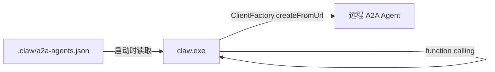
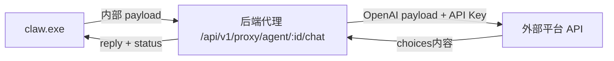
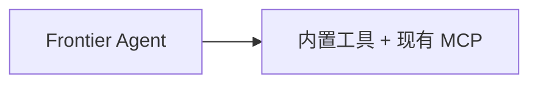

# Frontier A2A 与外部 Agent 集成指南（claw.exe 直接集成）

本指南说明如何在 **claw.exe（纯 Rust）** 中可选地添加远程 Agent 委派能力，包括：

1. **原生 A2A Agent** — 通过 Agent Card 发现，经 A2A 协议委派
2. **OpenAI 兼容外部 Agent** — FastGPT、Dify 等，经后端安全代理路由
3. **任务进度追踪** — 流式监听 `status-update` / `artifact-update`，在工具返回值中展示进度

> **核心原则：** 这是**零副作用的可选插件**。配置文件缺失或 `agents` 为空时，Frontier 行为与今天完全一致。  
> **集成方式：** 在 claw.exe 源码的 agent 初始化阶段**直接注册** function calling 工具，**不使用 MCP 服务器**。

**Rust 移植专章：** [claw-rust-integration.md](./claw-rust-integration.md)

---

## 目录

1. [架构总览](#架构总览)
2. [Frontier 现状（基线）](#frontier-现状基线)
3. [快速开始](#快速开始)
4. [第一部分 — 原生 A2A Agent](#第一部分--原生-a2a-agent)
5. [第二部分 — OpenAI 兼容外部 Agent](#第二部分--openai-兼容外部-agent)
6. [任务进度与任务管理](#任务进度与任务管理)
7. [claw.exe 集成步骤](#clawexe-集成步骤)
8. [测试清单](#测试清单)
9. [排错指南](#排错指南)
10. [文件索引](#文件索引)

---

## 架构总览

### 原生 A2A 流程（推荐用于 A2A 合规 Agent）



工具名示例：`weather_agent`（**非** `mcp__a2a__weather_agent`）

### 外部 Agent 流程（FastGPT、Dify 等）



**安全规则：** 第三方 API Key **永不**到达前端或 claw 进程，所有外部流量经后端代理。

### 禁用状态（零副作用）



当 `agents: []` 或配置文件缺失时，无任何变化。

### 与 MCP 方案对比

| 维度 | 本方案（claw 直接集成） | MCP 备选方案 |
|------|------------------------|-------------|
| 改动位置 | claw.exe Rust 源码 | 新增 MCP exe + main.js 注册 |
| 工具名 | `weather_agent` | `mcp__a2a__weather_agent` |
| 副作用 | 配置为空时完全跳过 | MCP 进程仍启动（tools/list 为空） |
| 推荐场景 | 有 claw 源码访问权 | 无法修改 claw 二进制 |

---

## Frontier 现状（基线）

Frontier 发布版后端（`D:\Work Projects\Frontier\backend-dist\backend\src`）是**协议桥接层**，不是 agent 核心：

| 层级 | 职责 |
|------|------|
| `agui-server.js` | HTTP/SSE API，将 TCP 事件映射为 AG-UI 事件 |
| `claw-process.js` | 启动 `claw.exe`，传入 API Key / 模型环境变量 |
| `claw.exe` | LLM + function calling + MCP 工具执行 |
| `.claw/settings.json` | MCP 服务器注册表 |

**工具注册发生在 claw.exe 内部。** 本方案在 claw 的 agent 初始化阶段追加 A2A 委派工具，**无需修改** `agui-server.js`——进度文本写入 tool 返回值即可被 UI 展示。

`claw-process.js` 启动时 `cwd` 指向 workspace（`%APPDATA%/frontier-desktop`），因此默认配置路径 `.claw/a2a-agents.json` 可直接读取。

---

## 快速开始

### 1. 安装依赖

```powershell
cd "D:\Work Projects\Agent2Agent"
npm install
```

### 2. 启动示例 A2A Agent

```powershell
# 终端 1
npx tsx weather_agent.ts

# 终端 2（可选，多步委派测试）
npx tsx file_write_agent.ts
```

### 3. 复制配置文件

```powershell
$clawDir = "$env:APPDATA\frontier-desktop\.claw"
New-Item -ItemType Directory -Force -Path $clawDir | Out-Null
Copy-Item docs\frontier-a2a-integration\a2a-agents.example.json "$clawDir\a2a-agents.json"
```

### 4. 验证 TypeScript 参考实现（claw 集成前的逻辑验证）

```powershell
$env:A2A_CONFIG_PATH = ".\docs\frontier-a2a-integration\a2a-agents.example.json"
npx tsx docs\examples\direct-agent-integration.ts "查询东京天气"
```

### 5. claw.exe 集成

参照 [claw-rust-integration.md](./claw-rust-integration.md) 在 Rust 源码中实现 4 个集成挂点。

---

## 第一部分 — 原生 A2A Agent

### 配置文件

**路径优先级：**

1. 函数参数 `configPath`
2. 环境变量 `A2A_CONFIG_PATH`
3. 默认：`{CLAW_WORKSPACE}/.claw/a2a-agents.json`

**示例：** [a2a-agents.example.json](./a2a-agents.example.json)

```json
{
  "agents": [
    {
      "id": "weather",
      "type": "native",
      "url": "http://localhost:4000",
      "enabled": true
    }
  ],
  "webhook": {
    "enabled": false,
    "url": "http://localhost:5000/webhook/task-updates",
    "token": "orchestrator-webhook-token"
  },
  "options": {
    "connectTimeoutMs": 5000,
    "failFast": false
  }
}
```

| 字段 | 必填 | 说明 |
|------|------|------|
| `agents[].url` | 是 | **仅基础 URL** — SDK 自动请求 `/.well-known/agent-card.json` |
| `agents[].enabled` | 否 | 默认 `true`；`false` 跳过该 Agent |
| `options.failFast` | 否 | `true` = 任一 Agent 不可达则启动失败；`false` = 跳过失败的 |
| `webhook.enabled` | 否 | 启用后在委派请求中附加推送通知配置 |

### 客户端创建

```typescript
import { ClientFactory } from "@a2a-js/sdk/client";

const factory = new ClientFactory();
const client = await factory.createFromUrl("http://localhost:4000");
const card = await client.getAgentCard();
// card.name, card.description, card.skills → 用于工具注册
```

完整模块：[`docs/examples/a2a-config-loader.ts`](../examples/a2a-config-loader.ts)

### 工具注册

每个远程 Agent 变成一个 function calling 工具：

| 集成方式 | LLM 中的工具名 |
|---------|---------------|
| claw 直接集成（本方案） | `weather_agent` |
| MCP 备选方案 | `mcp__a2a__weather_agent` |

工具 schema（两种路径相同）：

```json
{
  "task": "委派给该远程 Agent 的完整自然语言任务"
}
```

### 零副作用行为

| 场景 | 行为 |
|------|------|
| 配置文件缺失 | 跳过 A2A，记录 info 日志，继续 |
| `agents: []` | 同上 |
| 单个 URL 不可达 + `failFast: false` | 跳过该 Agent，注册其余 |
| 单个 URL 不可达 + `failFast: true` | 启动时抛错 |
| 全部跳过 | 工具列表与集成前完全一致 |

---

## 第二部分 — OpenAI 兼容外部 Agent

用于**非 A2A** 平台（FastGPT、Dify、自定义 OpenAI 兼容端点）。

### 适配器 / 代理模式

```
[claw] → 内部 payload → [后端代理] → OpenAI payload → [外部 API]
```

| 层级 | 职责 |
|------|------|
| `OpenAIProxyAdapter.ts` | 客户端适配器，调用代理端点 |
| `proxy_router.ts` | 从 DB 获取凭证，转换 payload，转发请求 |
| `external-agents.json` | claw 侧元数据（无密钥） |

### 数据库 Schema（生产环境）

```typescript
interface ExternalAgentConfig {
  id: string;            // 数据库生成的全局唯一 ID
  user_id: string;       // 所有者 — 用于 IDOR 防护
  name: string;          // 显示名称（mock Agent Card）
  description: string;   // 能力描述
  base_url: string;      // 如 https://api.fastgpt.in/api/v1/chat/completions
  api_key: string;       // 静态加密存储；绝不暴露给前端
}
```

### Payload 转换

**客户端 → 代理（内部格式）：**

```json
{
  "message": "你好，请分析这些数据",
  "history": [
    { "role": "user", "content": "之前的提问" },
    { "role": "assistant", "content": "之前的回复" }
  ],
  "stream": false
}
```

**代理 → 外部（OpenAI 格式）：**

```json
{
  "model": "agent",
  "messages": [
    { "role": "user", "content": "之前的提问" },
    { "role": "assistant", "content": "之前的回复" },
    { "role": "user", "content": "你好，请分析这些数据" }
  ],
  "stream": false
}
```

**代理 → 客户端（内部响应）：**

```json
{
  "reply": "分析完成：...",
  "status": "success"
}
```

### 统一客户端工厂

[`docs/examples/client-factory.ts`](../examples/client-factory.ts) 按 `type` 路由：

```typescript
import { clientFactory } from "./client-factory.ts";
import { delegateTask } from "./a2a-config-loader.ts";

// 原生 A2A
const native = await clientFactory.create(
  { type: "native", url: "http://localhost:4000", id: "weather" },
  undefined,
  delegateTask,
);

// OpenAI 兼容（经代理）
const external = await clientFactory.create(
  {
    type: "openai_compatible",
    id: "fastgpt-assistant",
    name: "FastGPT 助手",
    description: "产品文档问答",
  },
  "http://localhost:8081/api/v1/proxy/agent",
);

await native.sendTask("查询东京天气");
await external.sendTask("总结发布说明");
```

### 后端代理

[`docs/examples/proxy_router.ts`](../examples/proxy_router.ts)

本地开发独立服务：

```powershell
$env:EXTERNAL_AGENTS_JSON = ".\docs\examples\external-agents-registry.example.json"
npx tsx docs\examples\proxy-server.ts
```

**安全要求：**

1. 转发前验证请求用户是否拥有 `agent_id`（防 IDOR）
2. 响应中绝不返回 `api_key`
3. 兼容不同的 `base_url` 格式 — 部分平台要求在配置中写完整 `/v1/chat/completions` 路径，UI 表单需说明

### Frontier 外部 Agent 配置

[external-agents.example.json](./external-agents.example.json) — 仅元数据，无密钥：

```json
{
  "proxyBaseUrl": "http://localhost:8081/api/v1/proxy/agent",
  "agents": [
    {
      "id": "fastgpt-assistant",
      "type": "openai_compatible",
      "name": "FastGPT 助手",
      "description": "回答产品文档相关问题。",
      "enabled": true
    }
  ]
}
```

---

## 任务进度与任务管理

### A2A 任务生命周期

```
submitted → working → completed
                    → failed
                    → canceled
```

### 流式进度（原生 A2A）

`delegateTask()` 监听 `sendMessageStream` 事件：

| 事件 | 处理 |
|------|------|
| `task` | 记录 task ID 与初始状态 |
| `status-update` | 追加状态到进度链 |
| `artifact-update` | 记录 artifact 名称 |
| `final: true` | 获取最终任务，返回结果 |

### 工具输出格式

```
[Weather Agent] Task abc-123: submitted → working → completed
Result: It's always sunny in Tokyo!
```

Frontier 现有的 `tool_start` / `tool_end` SSE 事件会展示此文本 — **无需修改** `agui-server.js`。

### 实时进度 vs 批量输出

| 层级 | 当前行为 | 如何实现实时 |
|------|---------|-------------|
| **CLI 演示** (`direct-agent-integration.ts`) | 使用 `onProgress` + `agent.stream({ streamMode: "updates" })` | 每个 `submitted → working → completed` 立即打印 |
| **Frontier UI** | `tool_start` 在工具开始时触发；`tool_end` 在工具**全部完成**后一次性返回 | claw 需在工具执行中发送**增量** TCP 消息（见下方） |

**为何之前看起来“卡住”？** 旧版使用 `agent.invoke()`（阻塞到全部结束），且 `delegateTask()` 虽接收流式事件但未调用 `onProgress`，因此终端只在最后打印汇总。

**claw.exe 实时 UI 方案（Rust）：** 在 `delegate_task` 每次 `status-update` 时，通过 claw TCP 协议发送增量 tool 输出（例如在 `tool_start` 之后、`tool_end` 之前推送进度文本）。若仅发送 `tool_end`，UI 仍会在工具完成后才显示全部内容。

```typescript
// TypeScript 参考：注册进度回调
import { createConsoleProgressLogger, buildHandoffTools } from "./a2a-config-loader.ts";

const handoffTools = buildHandoffTools(entries, {
  onProgress: createConsoleProgressLogger("[A2A]"),
  onToolStart: (name, tool, task) => console.log(`>>> 委派 ${name}`),
});
```

### 查询 API

```typescript
import { getTaskProgress, getAllTaskProgress } from "./a2a-config-loader.ts";

const progress = getTaskProgress("abc-123");
// { taskId, agentName, states: ["submitted", "working", "completed"], ... }

const all = getAllTaskProgress();
```

### Webhook 推送通知（可选）

`webhook.enabled: true` 时，委派请求包含 `pushNotificationConfig`。远程 Agent 向 webhook URL POST 状态更新，请求头为 `x-a2a-notification-token`。

参考：[`orchestrator.ts`](../../orchestrator.ts) 第 17–36 行。

### 外部 Agent

OpenAI 兼容平台通常不发送 A2A 任务事件。外部 Agent 的进度为 **请求/响应模式**，显示为 `processing → success`。

---

## claw.exe 集成步骤

> 详细 Rust 代码见 [claw-rust-integration.md](./claw-rust-integration.md)

### 挂点 1：启动时加载配置

```rust
let a2a_config = load_a2a_config(&workspace_root);
// None 或 agents 为空 → 跳过，不 panic
```

### 挂点 2：Agent 初始化合并工具

```typescript
// TypeScript 参考（direct-agent-integration.ts）
const a2aConfig = loadA2AConfig();
if (isA2AEnabled(a2aConfig)) {
  const entries = await createA2AClients(a2aConfig!);
  if (entries.length > 0) {
    tools.push(...buildHandoffTools(entries, { webhook: a2aConfig!.webhook }));
    systemPrompt += "\n\n" + buildA2ASystemPromptSupplement(entries);
  }
}
```

### 挂点 3 & 4：工具执行与返回值

- 执行时调用 `delegateTask()`（原生）或代理适配器（外部）
- 返回值包含进度链 + 最终结果

### 建议 Rust 模块

```
src/a2a/config.rs      — JSON 解析
src/a2a/client.rs      — Agent Card + JSON-RPC
src/a2a/tools.rs       — ToolDefinition 生成
src/a2a/delegate.rs    — 流式进度 + 内存表
src/external/adapter.rs — 代理调用
```

### 可选：委派引导 Skill

在 `Frontier/skills/a2a-delegation/SKILL.txt` 添加中文说明，引导模型在合适场景使用委派工具：

```
当用户请求涉及远程专家能力（天气查询、文件写入、文档问答等）时，
优先调用对应的委派工具（如 weather_agent），而非自行编造结果。
```

---

## 测试清单

| 场景 | 预期 |
|------|------|
| 无配置文件 | Frontier 正常启动，无新工具 |
| `agents: []` | 同上 |
| 有效 A2A URL | 工具可调用，返回含进度链的结果 |
| 单个坏 URL + `failFast: false` | 其余 Agent 仍注册 |
| 单个坏 URL + `failFast: true` | 启动失败，错误信息清晰 |
| 多步任务 | 依次调用 weather → file_write |
| 外部代理 + 有效 Key | 返回 reply |
| 外部代理 IDOR 尝试 | 非所有者得 404 |
| 删除配置文件后重启 | 行为与集成前一致 |

---

## 排错指南

| 问题 | 可能原因 | 解决 |
|------|---------|------|
| 工具列表为空 | `A2A_CONFIG_PATH` 错误或 `agents` 为空 | 检查环境变量和 JSON |
| Agent Card 获取失败 | Agent 未启动或 URL 错误 | URL 必须是基础地址，不是 `/a2a/jsonrpc` |
| 工具调用挂起 | 远程 Agent 响应慢 | 增加超时；检查远程日志 |
| LLM 不调用 A2A 工具 | 缺少 prompt / skill 引导 | 添加 `a2a-delegation` skill |
| 外部代理 404 | Agent ID 不在 DB 或用户不匹配 | 检查 ownership 校验 |
| 外部代理 502 | `base_url` 格式错误 | 配置中写完整 `/v1/chat/completions` 路径 |

---

## 文件索引

### Agent2Agent 仓库

| 文件 | 用途 |
|------|------|
| [README.zh-CN.md](./README.zh-CN.md) | 本文档 |
| [claw-rust-integration.md](./claw-rust-integration.md) | Rust 移植专章 |
| [a2a-agents.example.json](./a2a-agents.example.json) | 原生 A2A 配置示例 |
| [external-agents.example.json](./external-agents.example.json) | 外部 Agent 元数据示例 |
| [a2a-config-loader.ts](../examples/a2a-config-loader.ts) | 配置加载、客户端、handoff 工具、进度追踪 |
| [direct-agent-integration.ts](../examples/direct-agent-integration.ts) | 端到端集成参考（非 MCP） |
| [client-factory.ts](../examples/client-factory.ts) | 统一工厂：native + openai_compatible |
| [OpenAIProxyAdapter.ts](../examples/OpenAIProxyAdapter.ts) | 外部 Agent 客户端适配器 |
| [proxy_router.ts](../examples/proxy_router.ts) | 后端安全代理（Express 路由） |
| [proxy-server.ts](../examples/proxy-server.ts) | 本地开发代理服务 |
| [external-agents-registry.example.json](../examples/external-agents-registry.example.json) | 代理服务本地 DB 替代 |
| [orchestrator.ts](../../orchestrator.ts) | 参考编排器（流式 + webhook） |
| [weather_agent.ts](../../weather_agent.ts) | 示例 A2A 服务（端口 4000） |
| [file_write_agent.ts](../../file_write_agent.ts) | 示例 A2A 服务（端口 4002） |

### Frontier 仓库（集成目标）

| 文件 | 改动 |
|------|------|
| `claw.exe` Rust 源码 | **是** — 本方案核心 |
| `agui-server.js` | 否 |
| `main.js` | 否 |
| `%APPDATA%/frontier-desktop/.claw/a2a-agents.json` | 用户可选配置 |
| `%APPDATA%/frontier-desktop/.claw/external-agents.json` | 用户可选配置 |

---

## 建议实施顺序

1. **阶段 1 — 配置加载 + 客户端创建**  
   实现 `load_a2a_config` / `create_a2a_clients`，用 `weather_agent.ts` 验证 Agent Card 拉取

2. **阶段 2 — Handoff 工具注册**  
   在 agent 初始化中条件合并工具，验证 `weather_agent` 可被 LLM 调用

3. **阶段 3 — 进度追踪**  
   实现流式 `delegate_task`，确认 tool 输出含 `submitted → working → completed`

4. **阶段 4 — 外部 Agent**  
   部署 `proxy_router`，claw 侧加载 `external-agents.json` 并注册代理工具

---

## 代码对照

| 概念 | Agent2Agent 参考 | claw.exe 集成 |
|------|-----------------|--------------|
| 创建 A2A 客户端 | `orchestrator.ts` L171–173 | `a2a-config-loader.ts` → `createA2AClients()` |
| 构建 handoff 工具 | `orchestrator.ts` L123–166 | `a2a-config-loader.ts` → `buildHandoffTools()` |
| 流式委派 | `orchestrator.ts` L70–112 | `a2a-config-loader.ts` → `delegateTask()` |
| claw 启动集成 | — | `direct-agent-integration.ts` |
| Rust 移植 | — | `claw-rust-integration.md` |
| 外部代理 | — | `OpenAIProxyAdapter.ts` + `proxy_router.ts` |
| Agent Card（服务端） | `weather_agent.ts` L31–57 | 远程 `/.well-known/agent-card.json` |
